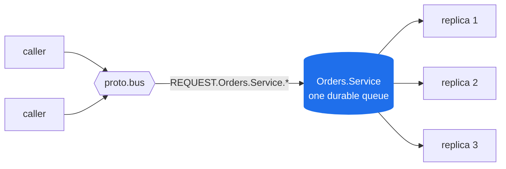
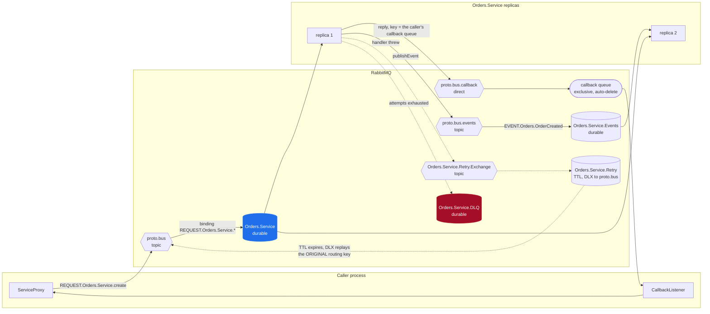
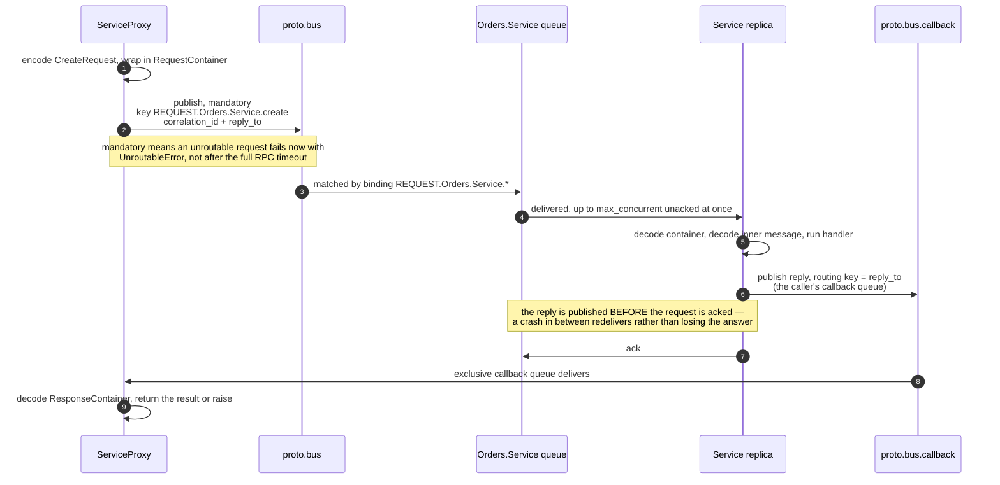
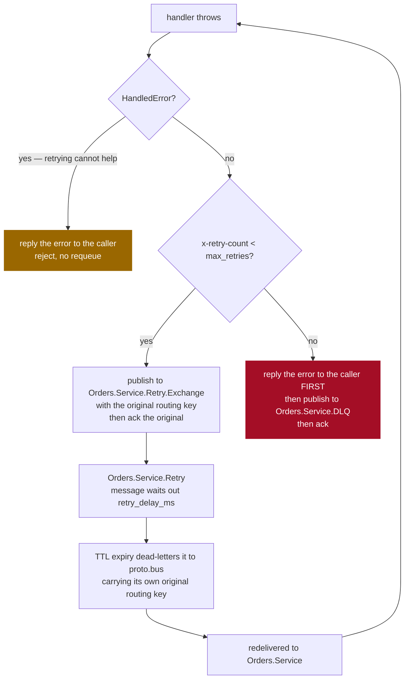
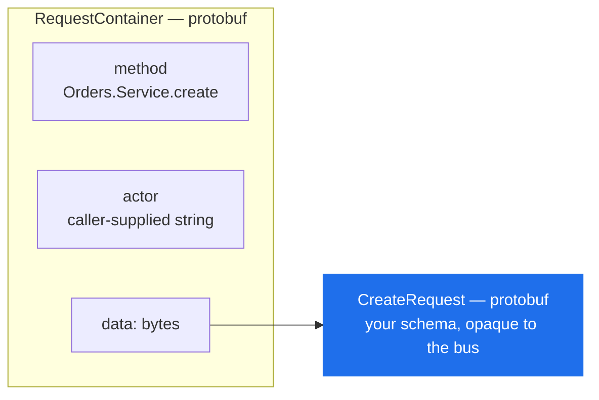
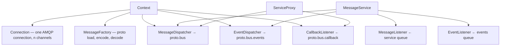

# Architecture

> How a protobus service becomes RabbitMQ topology, and what happens to a message between `await proxy.add(...)` and the result coming back.

**Read this if** you are evaluating protobus, or you have a service running and want to understand what you are looking at in the RabbitMQ management UI.

| | |
|---|---|
| **Prerequisites** | [Getting Started](../guide/getting-started.md) — you have run one service |
| **Next** | [Configuration](../reference/configuration.md) · [Error Handling](../guide/error-handling.md) |
| **Source** | [`protobus/context.py`](../../protobus/context.py) · [`protobus/connection.py`](../../protobus/connection.py) · [`protobus/message_listener.py`](../../protobus/message_listener.py) |

**On this page** — [The one idea](#the-one-idea) · [What a service creates](#what-a-service-creates-in-the-broker) · [The RPC round trip](#the-rpc-round-trip) · [When a handler fails](#when-a-handler-fails) · [Exchanges](#exchange-reference) · [Queues](#queue-reference) · [Wire format](#wire-format) · [Components](#components)

---

## The one idea

A protobus service is **one durable queue** bound to a topic exchange, and **N processes competing for it**.

Load balancing, failover, backpressure, retry delay and priority are then properties RabbitMQ already gives that queue: competing consumers, redelivery of an unacked message, prefetch, a TTL queue with a dead-letter exchange, `x-max-priority`. What protobus implements in Python is the part above the broker — publisher-confirm tracking, the decision to retry or answer, the topology declarations and their restoration, reply correlation, stream buffering and cancellation. What it does *not* implement is any of the queueing itself.

That is the whole design, and it is what makes the rest of this page short.



Add a replica and the queue is shared between one more consumer — which raises throughput when the handler, not the broker or a downstream, is the bottleneck. Kill a replica mid-message and the unacked delivery returns to the queue for another replica. Neither is protobus code.

---

## What a service creates in the broker

Start one service named `Orders.Service` and four queues appear. Most people meet this diagram for the first time in the management UI, wondering what `Orders.Service.Retry` is.



> [!NOTE]
> Solid arrows are the happy path. Dashed arrows only ever carry a message whose handler threw.

Three things in that picture surprise people, so they are worth saying in words:

- **`Orders.Service.Events` is a queue, not a subscription.** It is durable and it is *not* auto-delete. Events published while every replica is down are still there when one comes back. It also means an event queue for a service you deleted keeps filling forever — see [Queue Migration](../operations/queue-migration.md).
- **The callback queue is per *client process*, exclusive and auto-deleting.** It vanishes when the client disconnects, which is why an in-flight RPC whose caller died is simply dropped rather than replied to.
- **The retry queue has no consumer.** Messages sit in it until their TTL expires and RabbitMQ dead-letters them back onto `proto.bus`. The delay *is* the TTL. Nothing sleeps in Python.

---

## The RPC round trip



Two properties of that sequence are load-bearing and easy to miss:

> [!IMPORTANT]
> **The publish returns on a broker confirm, not a local buffer write.** `await publish(...)` returning means RabbitMQ acknowledged the message. It costs a round trip, and it is the reason a resolved publish is worth anything.

> [!IMPORTANT]
> **The reply goes out before the ack.** The opposite order — ack, then reply — loses the response if the process dies in between, with the request already settled and unable to be redelivered.

---

## When a handler fails

This is the part with no equivalent in a transport-agnostic framework, and the part an operator ends up living in.



> [!WARNING]
> **The caller stays parked for the whole ladder.** No reply is published while a message is being retried. With the defaults — `max_retries=3`, `retry_delay_ms=5000` — a permanently failing call blocks its caller for roughly 15 seconds before it raises. Size `RPC_CALL_TIMEOUT_MS` against `max_retries × retry_delay_ms`, not against one handler run.

Every hop stamps headers on the message. These are the ops surface — a message sitting in a DLQ can be read back without any application logging:

| Header | Set on | Meaning |
|---|---|---|
| `x-retry-count` | every retry and the DLQ copy | attempts made so far |
| `x-original-routing-key` | retry, DLQ | the key the message must be replayed with |
| `x-first-failure-time` | retry, DLQ | epoch ms of the *first* failure, preserved across hops |
| `x-last-error` | retry, DLQ | the class name (and `code`) of the exception that caused this hop — never its message, unless it was a `HandledError` |
| `x-original-queue` | DLQ | which service's queue gave up on it |
| `x-dlq-time` | DLQ | epoch ms it was dead-lettered |

`correlation_id` and `message_id` are carried through unchanged, so a retried copy is recognisable as the same logical message.

<details>
<summary><b>Why the retry exchange exists at all</b> — publishing straight to the queue would be simpler</summary>

<br/>

A message parked on `Orders.Service.Retry` comes back via RabbitMQ's dead-letter mechanism, and the DLX republishes it **with the routing key it arrived carrying**. If the message had been published straight to the retry queue through the default exchange, that key would be `Orders.Service.Retry` — which matches no binding on the main queue, so the redelivery would route nowhere and be dropped.

Publishing to a per-service *topic* exchange bound with `#` preserves the original `REQUEST.Orders.Service.create` key across the queue → TTL → DLX → `proto.bus` round trip, so the redelivery lands back on the service queue. That is the entire reason `<Service>.Retry.Exchange` exists.

See `Connection.consume` in [`protobus/connection.py`](../../protobus/connection.py) and `MessageListener.setup_retry_queues` in [`protobus/message_listener.py`](../../protobus/message_listener.py).

</details>

---

## Exchange reference

Five exchanges, three of them shared by the whole bus and two per service.

| Exchange | Type | Scope | Carries | Env override |
|---|---|---|---|---|
| `proto.bus` | topic | shared | RPC requests | `BUS_EXCHANGE_NAME` |
| `proto.bus.callback` | direct | shared | RPC replies, keyed by the caller's callback queue name | `CALLBACKS_EXCHANGE_NAME` |
| `proto.bus.events` | topic | shared | published events | `EVENTS_EXCHANGE_NAME` |
| `proto.bus.cancel` | fanout | shared | stream cancellation notices ([Streaming](../guide/streaming.md#cancellation)) | `CANCEL_EXCHANGE_NAME` |
| `<Service>.Retry.Exchange` | topic | per service | failed messages awaiting redelivery | — |

### Routing keys

| Traffic | Key | Example |
|---|---|---|
| RPC request | `REQUEST.<Package>.<Service>.<method>` | `REQUEST.Orders.Service.create` |
| Service binding | `REQUEST.<Package>.<Service>.*` | one queue serves every method |
| RPC reply | the caller's `reply_to` queue name | `amq.gen-JzTY20BRgKO-HjmUJj0wLg` |
| Event, default | `EVENT.<Package>.<EventType>` | `EVENT.Orders.OrderCreated` |
| Event, custom topic | anything you pass | `ORDERS.US.SHIPPED`, matched by `ORDERS.*.SHIPPED` |

> [!IMPORTANT]
> **A reply is routed by the caller's queue name, not by its `correlation_id`.**
> The callback queue is anonymous and exclusive, so the broker names it
> (`amq.gen-…`), and it is bound to `proto.bus.callback` under that name
> ([`protobus/base_listener.py`](../../protobus/base_listener.py)). `correlation_id` is an
> AMQP *property* carried alongside, and it is what the caller's process uses to
> match the reply to the right pending future — the broker never looks at it.

> [!NOTE]
> A service binds `REQUEST.<Service>.*` — **one queue for every method**. That is what makes [Message Priority](../guide/priority.md) necessary: a slow bulk method and a fast control method share a lane.

---

## Queue reference

| Queue | Durable | Auto-delete | Exclusive | Consumed by |
|---|---|---|---|---|
| `<Service>` | yes | no | no | every replica, competing |
| `<Service>.Events` | yes | no | no | every replica, competing |
| `<Service>.Retry` | yes | no | no | **nobody** — drained by TTL expiry |
| `<Service>.DLQ` | yes | no | no | **nobody** — you |
| callback queue | no | yes | yes | the one client process that declared it |
| cancel queue | no | yes | yes | the one service process that declared it |

**Persistence.** Every request and event is published `delivery_mode=2`. Combined with durable queues, messages survive a broker restart.

**Acknowledgement.** Services ack late by default: the delivery is acked after the handler returns and its reply is away. Failures take the ladder above — protobus does **not** nack-with-requeue, because an immediate requeue of a message that just failed is a hot loop.

---

## Concurrency

> [!CAUTION]
> `max_concurrent` is the consumer prefetch and it **defaults to `1`**. One replica handles one message at a time, holding the slot until the handler returns. This is deliberate and conservative — and it means a service that does I/O and was never configured is leaving almost all of its throughput on the table.

```python
# A service that awaits anything almost always wants this raised.
service = OrdersService(context, max_concurrent=10)
```

It bounds memory as well as throughput: with late ack the broker will push up to `max_concurrent` unacked messages into the process. Scale out with more processes, not by co-locating services — one asyncio loop is one core, so co-location buys no parallelism and couples failure domains.

Full detail in [Configuration → Concurrency](../reference/configuration.md#concurrency).

---

## Wire format

Every message is **two layers of protobuf**: an outer container carrying routing metadata, and the opaque encoded bytes of your own message inside it.



The bus routes, retries, dead-letters and logs a message without ever needing your schema. Only the two endpoints decode the inner layer.

<details>
<summary><b>Container definitions</b> — from <code>protobus/message_factory.py</code></summary>

<br/>

```protobuf
message RequestContainer {
    string method = 1;   // Package.Service.method
    string actor  = 2;   // caller-supplied; see the Security model
    bytes  data   = 3;   // encoded request message
}

message ResponseContainer {
    oneof value {
        ResponseResult result = 1;
        ResponseError  error  = 2;
    }
}

message ResponseResult {
    string method = 1;
    bytes  data   = 2;   // encoded response message
}

message ResponseError {
    string method  = 1;
    string message = 2;
    string code    = 3;  // the code passed to HandledError
}

message EventContainer {
    string type  = 1;    // Package.EventType
    string topic = 2;    // routing topic
    bytes  data  = 3;    // encoded event message
}
```

</details>

> [!WARNING]
> `actor` is set by the caller and nothing verifies it. It is for tracing, never for authorisation — see the [Security model](../operations/security.md).

---

## Components

<details>
<summary><b>Object graph</b> — what holds what</summary>

<br/>



</details>

| Component | Responsibility | Source |
|---|---|---|
| **Context** | one AMQP connection, the proto registry, the shared dispatchers. Create one per process. | [`protobus/context.py`](../../protobus/context.py) |
| **Connection** | channels, declarations, bindings, reconnection, publish confirms, the retry ladder | [`protobus/connection.py`](../../protobus/connection.py) |
| **MessageFactory** | parses `.proto` files (no `protoc`); encodes and decodes both layers | [`protobus/message_factory.py`](../../protobus/message_factory.py) · [`protobus/proto_parser.py`](../../protobus/proto_parser.py) |
| **MessageService** | serves a queue: dispatches RPCs to your methods, subscribes to events | [`protobus/message_service.py`](../../protobus/message_service.py) |
| **RunnableService** | `MessageService` plus process lifecycle — proto resolution by convention, SIGINT/SIGTERM, drain, non-zero exit on boot failure | [`protobus/runnable_service.py`](../../protobus/runnable_service.py) |
| **ServiceProxy** | builds method stubs from the proto and calls them over the bus | [`protobus/service_proxy.py`](../../protobus/service_proxy.py) |
| **Trie** | wildcard topic matching for event subscriptions | [`protobus/trie.py`](../../protobus/trie.py) |
| **CancelListener** | hears stream-cancellation notices on `proto.bus.cancel` and aborts the matching handler | [`protobus/cancel_listener.py`](../../protobus/cancel_listener.py) |

---

### See it for yourself

```bash
docker compose up -d
PYTHON=$PWD/venv/bin/python scripts/run-combat-sample.sh   # six services, RPC + events + shutdown
open http://localhost:15672                                 # guest / guest — the queues above, live
```

---

<div align="center">

**[← Getting Started](../guide/getting-started.md)** · **[Docs index](../README.md)** · **[Configuration →](../reference/configuration.md)**

</div>
