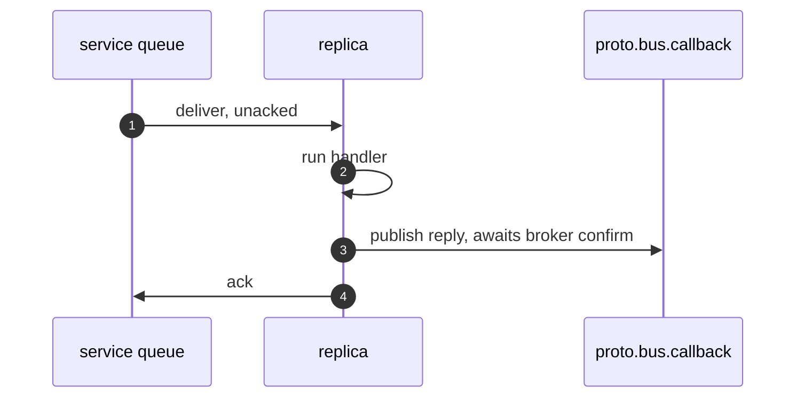
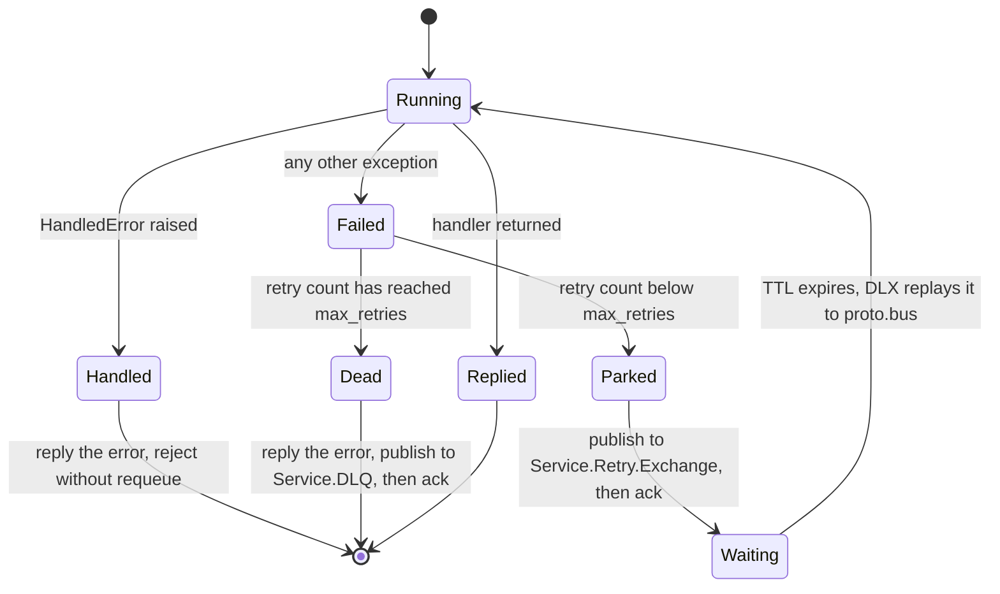
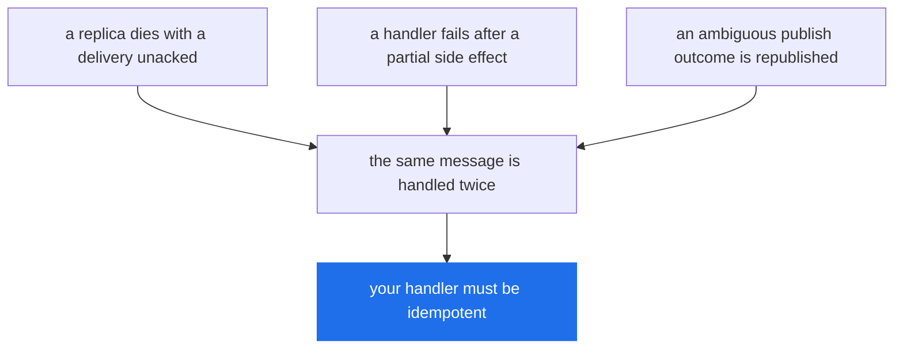

# Delivery Guarantees

> What a resolved `publish()` actually promises, what happens to a message whose handler threw, and where duplicates come from.

**Read this if** you are deciding how much your handlers have to defend themselves — or you are staring at a non-empty `<Service>.DLQ` and want to know how those messages got there.

| | |
|---|---|
| **Prerequisites** | [Architecture](./architecture.md) — you know what a service declares in the broker |
| **Next** | [Error Handling](../guide/error-handling.md) · [Configuration](../reference/configuration.md) · [Troubleshooting](../operations/troubleshooting.md) |
| **Source** | [`protobus/connection.py`](../../protobus/connection.py) · [`protobus/message_listener.py`](../../protobus/message_listener.py) · [`protobus/message_dispatcher.py`](../../protobus/message_dispatcher.py) · [`protobus/message_service.py`](../../protobus/message_service.py) · [`protobus/errors.py`](../../protobus/errors.py) · [`protobus/config.py`](../../protobus/config.py) |

**On this page** — [The claim](#the-claim) · [What a resolved publish means](#what-a-resolved-publish-means) · [Ack ordering](#ack-ordering) · [The retry ladder](#the-retry-ladder) · [The x- headers](#the-x--headers) · [The parked caller](#the-parked-caller) · [Where duplicates come from](#where-duplicates-come-from) · [What to do about it](#what-to-do-about-it)

---

## The claim

Protobus gives you **at-least-once delivery with publisher confirms**, and nothing stronger.

Every part of that sentence is load-bearing:

- **At-least-once** — a message that is delivered may be delivered again. There is no deduplication anywhere in the library.
- **With publisher confirms** — a `publish()` that resolves means RabbitMQ said it has the message, not that a local buffer accepted the bytes.
- **Nothing stronger** — there is no exactly-once, no transactional handoff between the message and your database, and no ordering guarantee across replicas.

At-least-once holds for the transfers protobus performs itself. One transfer in
the retry ladder is performed by the broker instead, and it is not confirmed —
see [Where a message can still be lost](#where-a-message-can-still-be-lost).

The rest of this page is what that costs you and what the library does to keep the cost small.

---

## What a resolved publish means

Channels are opened with `publisher_confirms=True` ([`protobus/connection.py`](../../protobus/connection.py), `open_channel`). A returned `publish()` therefore means all three of:

1. the broker positively confirmed the publication (`basic.ack`);
2. it was **routed**, when `mandatory` asked for routing to be enforced;
3. the channel's local write buffer has drained.

Everything else is a typed exception. There are four, and the split that matters is not "which error" but **whether the outcome is known**.

| Error | `code` | Outcome | Safe to republish? |
|---|---|---|---|
| `PublishNackedError` | `PUBLISH_NACKED` | Definite: the broker refused it, nothing was stored | Yes |
| `UnroutableError` | `UNROUTABLE` | Definite: it reached the exchange and matched no queue | Yes |
| `PublishConfirmTimeoutError` | `PUBLISH_CONFIRM_TIMEOUT` | **Unknown**: no confirm arrived within `PUBLISH_CONFIRM_TIMEOUT_MS` | Only if the consumer deduplicates |
| `ChannelClosedError` | `CHANNEL_CLOSED` | **Unknown**: the channel went away with the publish unconfirmed | Only if the consumer deduplicates |

`PUBLISH_CONFIRM_TIMEOUT_MS` defaults to **30000** ms ([`protobus/config.py`](../../protobus/config.py), `publish_confirm_timeout_ms`). All four derive from `PublishError` and carry a `message_id`.

> [!CAUTION]
> **The last two are ambiguous, not failed.** The broker may have stored the message and lost only the confirm. Republishing on either can duplicate. That is not a defect being apologised for — it is the honest report of a state the client genuinely cannot observe, and the alternative designs are worse: reporting success loses messages, reporting failure invites a silent duplicate.

```python
from protobus import (
    ChannelClosedError,
    PublishConfirmTimeoutError,
    PublishNackedError,
    UnroutableError,
)


def is_ambiguous(error: BaseException) -> bool:
    """Republishing may duplicate."""
    return isinstance(error, (PublishConfirmTimeoutError, ChannelClosedError))


def is_definite_failure(error: BaseException) -> bool:
    """Republishing is safe."""
    return isinstance(error, (PublishNackedError, UnroutableError))
```

### `mandatory` on RPC requests

RPC requests are published with `mandatory=True`; events deliberately are not ([`protobus/message_dispatcher.py`](../../protobus/message_dispatcher.py), `publish`). RabbitMQ sends `basic.return` for a mandatory message that matched no queue **and then confirms it anyway**, so a confirm-only client would report success for a message that reached nothing. Protobus records the return and turns the confirm into an `UnroutableError`.

The practical effect: calling a service nobody is running fails in one broker round trip instead of waiting out the full RPC timeout. An event with no subscribers stays normal, because fan-out to nobody is a legitimate outcome.

### Deduplicating on `message_id`

Every publish carries a `message_id`, minted as a UUID by the publish path unless the properties already have one, and the same id is copied onto every retry and DLQ hop ([`protobus/connection.py`](../../protobus/connection.py), `_confirmed_publish` and the retry and DLQ publishes). It is the only thing that identifies two copies as one logical message, which is why the package root says so at the export site:

> A resolved `publish()` means the broker confirmed the message; these are the ways that can fail. `PublishConfirmTimeoutError` and `ChannelClosedError` are AMBIGUOUS — the message may or may not have been stored — so retrying either can duplicate. Deduplicate on `message_id`.
>
> — [`protobus/__init__.py`](../../protobus/__init__.py)

A handler reads it off the framework context, which arrives as the fourth argument to a service method that declares one, alongside `redelivered`. The context type is `MessageHandlerContext`, exported from the package root ([`protobus/connection.py`](../../protobus/connection.py)):

```python
from protobus import MessageHandlerContext, MessageService

already_done: set[str] = set()


class OrdersService(MessageService):
    service_name = "Orders.Service"
    proto_file_name = "./protos/orders.proto"

    async def create(self, request: dict, actor: str, correlation_id: str, ctx: MessageHandlerContext) -> dict:
        # message_id is stable across every redelivery and every retry hop.
        key = ctx.message_id
        if key in already_done:
            return {"ok": True}  # already applied; do not charge the card twice
        already_done.add(key)
        return {"ok": True}
```

> [!NOTE]
> An in-memory `set` is shown for brevity. In a real service the deduplication key belongs in the same store as the side effect, written in the same transaction — otherwise the process restarts and forgets what it applied.

### Deduplicating a caller's own republish

Redeliveries and retries carry the id for you. A caller's *own* republish — reacting to a `PublishConfirmTimeoutError` or a `ChannelClosedError` by calling the method again — does not, unless you say so: without an id of your own, the second attempt mints a fresh UUID and a fresh `correlation_id`, and the consumer has no way to see the two as one request.

`CallOptions.message_id` is that id. It is the last argument of a proxy method and of `Context.publish_message()`:

```python
from protobus import CallOptions, ChannelClosedError, PublishConfirmTimeoutError, ServiceProxy


async def create_once(orders: ServiceProxy, customer_id: str, request_id: str) -> dict:
    # Identify the WORK, not the attempt: derive it from the request, never
    # from a clock or a counter, or the two attempts get two identities.
    options = CallOptions(message_id=f"create-order-{request_id}")
    try:
        return await orders.create({"customerId": customer_id}, None, True, None, options)
    except (PublishConfirmTimeoutError, ChannelClosedError):
        # AMBIGUOUS: the broker may already hold the first copy. The same
        # message_id is what lets an idempotent consumer collapse them.
        return await orders.create({"customerId": customer_id}, None, True, None, options)
```

> [!NOTE]
> A blank `message_id` is refused with `InvalidMessageIdError` rather than falling back to a generated one. An id derived from a field that turned out to be empty would give every attempt a different identity and no deduplication at all — silently, which is the one outcome this option exists to prevent.

---

## Ack ordering

The order is **reply, then ack**, and it is chosen deliberately.



If the process dies between steps 3 and 4, the request is still unacked, so RabbitMQ redelivers it and the work is done twice — an outcome the retry ladder already assumes. If the order were reversed, a death in the same window would settle the request with the reply never sent: the caller waits out its whole timeout for an answer that no longer exists anywhere.

> [!IMPORTANT]
> **Ack-late is what makes any of this work.** `MessageService` sets `late_ack=True` by default ([`protobus/message_service.py`](../../protobus/message_service.py)). Setting it to `False` acks on delivery and disables the retry path, the DLQ path and the error reply *entirely* — a failure becomes a dropped message and a caller waiting for a reply that is never coming.

Two other consumers in the library behave differently, and both are worth knowing about:

- **The callback queue** (replies) acks on delivery, not late — `BaseListener` defaults `late_ack` to `False` and `CallbackListener` does not change it. The queue is exclusive and auto-deleting, so a caller that died has nowhere for a reply to be redelivered to anyway.
- **Event listeners** do ack late, but by default they register no retry options ([`protobus/event_listener.py`](../../protobus/event_listener.py)), so a failing event handler takes the no-retry branch: the delivery is rejected without requeue and the event is gone. **By default, events do not climb the ladder and never reach a DLQ.** If an event handler's work matters, either opt in to the [event retry ladder](../guide/events.md#retry) with `MessageServiceOptions(event_retry=...)`, or retry internally.

  The reject is also what keeps the consumer *alive*, which is easy to miss when reading this as a pure loss. Measured against a real broker in [`tests/integration/test_events_and_dlq.py`](../../tests/integration/test_events_and_dlq.py): five events whose handler throws are each delivered exactly once, the `.Events` queue is empty afterwards, no `.Events.DLQ` exists, and a healthy event published after all five is still processed. Leaving them unacknowledged instead would hold the prefetch — `DEFAULT_PREFETCH`, **1** unless `max_concurrent` is set — and stall the listener completely behind the first permanent failure. Losing the event is the deliberate trade for not deadlocking the subscriber.

---

## The retry ladder

This is what happens between a handler raising and a caller seeing an exception.

The first question is whether the error is *answered* or *retried*. A `HandledError` — or anything `is_handled_error`-shaped, meaning any exception with `is_handled = True` ([`protobus/errors.py`](../../protobus/errors.py)) — is a decision the service made deliberately, so it is replied to the caller at once and the delivery is rejected without requeue. Retrying it would buy three more identical failures.

`ProtocolError` and `InvalidMethodError` are `HandledError` subclasses for exactly this reason: an undecodable body decodes identically badly on every redelivery.

Everything else is treated as an infrastructure failure and climbs the ladder.



### The queues it uses

Declared by [`protobus/message_listener.py`](../../protobus/message_listener.py) (`setup_retry_queues`) the first time a service subscribes:

| Object | Arguments | Consumed by |
|---|---|---|
| `<Service>.Retry` | `x-message-ttl: retry_delay_ms`, `x-dead-letter-exchange: proto.bus` | nobody — drained by TTL expiry |
| `<Service>.Retry.Exchange` | topic, bound to `<Service>.Retry` with `#` | — |
| `<Service>.DLQ` | none | nobody — you |

The delay **is** the queue's TTL. Nothing sleeps in Python, and no timer holds the failed message in process memory.

The retry publish goes to the per-service *topic* exchange rather than straight to the queue, because RabbitMQ's dead-letter mechanism republishes a message **with the routing key it arrived carrying**. Put on the retry queue with `publish_to_queue`, that key would be `<Service>.Retry`, which matches no binding on the main queue — so the redelivery would route nowhere and vanish. This was a real defect in the TypeScript port, fixed in 1.4.0 there, and the exchange exists solely to preserve `REQUEST.<Service>.<method>` across the queue → TTL → DLX → `proto.bus` round trip.

### The defaults, and what they add up to

From [`protobus/message_listener.py`](../../protobus/message_listener.py), `DEFAULT_RETRY_OPTIONS`:

| Option | Default | Meaning |
|---|---|---|
| `max_retries` | `3` | retry hops before the DLQ; `0` disables retry and the DLQ entirely |
| `retry_delay_ms` | `5000` | becomes the retry queue's `x-message-ttl` |
| `message_ttl_ms` | `None` | `x-message-ttl` on the **main** queue, not the retry queue |

So a handler that fails every time runs **four times** — the original plus three retries — with **three** five-second parks between them.

There is no backoff. Every hop waits the same `retry_delay_ms`, because the delay is a queue argument and a queue has one TTL.

```python
from protobus import Context, MessageServiceOptions, RetryOptions, RunnableService


class ReportService(RunnableService):
    service_name = "Reports.Service"

    def __init__(self, context: Context):
        # 5 retries, 2s apart: 6 handler runs and 10s of parking, worst case.
        super().__init__(context, MessageServiceOptions(retry=RetryOptions(max_retries=5, retry_delay_ms=2000), max_concurrent=10))
```

> [!WARNING]
> **`retry_delay_ms` cannot be changed on a service that has already run.** It becomes `x-message-ttl` on `<Service>.Retry`, and RabbitMQ fixes queue arguments at declare time. A changed value fails startup with `RetryQueueMismatchError` wrapping a 406 `PRECONDITION_FAILED`. Drain and delete the retry queue first — see [Queue Migration](../operations/queue-migration.md).

---

## The `x-*` headers

Six headers are stamped by the retry and DLQ paths in [`protobus/connection.py`](../../protobus/connection.py). They are the entire ops debugging surface: a message sitting in a DLQ can be read back in the management UI without a single line of application logging.

| Header | Set when | What it is for |
|---|---|---|
| `x-retry-count` | every retry hop, and the DLQ copy | Which attempt this is. Incremented on each retry publish; the DLQ copy carries the count the message *arrived* with — with the defaults that is `3`, after four handler runs |
| `x-original-routing-key` | retry, DLQ | The `REQUEST.<Service>.<method>` key the message must be replayed with. This is the field you need to hand-replay a DLQ message |
| `x-first-failure-time` | retry, DLQ | Epoch ms of the **first** failure, carried forward unchanged across every later hop — so the DLQ entry tells you when the trouble started, not when it ended |
| `x-last-error` | retry, DLQ | A `safe_error_summary` of the exception that caused *this* hop |
| `x-original-queue` | DLQ only | Which service's queue gave up on it. The queue name is not otherwise recoverable from a DLQ message |
| `x-dlq-time` | DLQ only | Epoch ms it was dead-lettered. With `x-first-failure-time`, the width of the whole episode |

`correlation_id` and `message_id` are copied onto every hop as message properties, not headers, so a retried copy is still recognisable as the same logical message and still joins to the caller's log line.

> [!IMPORTANT]
> **`x-last-error` is redacted on purpose.** It carries the error's class name and `code`, never its message — `TypeError`, `MongoNetworkError[ECONNRESET]` — because this header persists in a queue and is read by dashboards and queue browsers, which are systems with looser access control than the bus. Exception messages routinely interpolate the value that caused them. A `HandledError` is exempt and keeps its message, since publishing that message was the point of raising it. See [`safe_error_summary`](../../protobus/errors.py) and the [Security model](../operations/security.md).

<details>
<summary><b>Reading a DLQ message</b> — what you get back, and what you do not</summary>

<br/>

RabbitMQ adds its own `x-death` array when the retry queue's TTL dead-letters a message, recording each queue it passed through and how many times. That is broker behaviour, not protobus. The DLQ copy is a fresh publish rather than a broker dead-lettering, so any `x-death` you see on it was carried over from an earlier retry hop — it does not record the trip to the DLQ.

What is **not** recoverable from a DLQ message:

- **The exception message and traceback**, deliberately. `x-last-error` gives you the class and code; the full text is in the service's own log, joined by `correlation_id`.
- **The caller.** Nothing in the message records who published it. The `actor` field inside the `RequestContainer` is caller-supplied and unverified — useful for tracing, never for attribution.
- **Whether the caller ever saw an error.** The DLQ path publishes an error reply *before* the DLQ copy, but a caller that had already given up is no longer listening for it.

</details>

---

## The parked caller

> [!IMPORTANT]
> **No reply is published while a message is climbing the ladder.** The caller's future is simply not settled. With the defaults — `max_retries=3`, `retry_delay_ms=5000` — a permanently failing call blocks its caller for **at least 15 seconds** of parking, plus four handler runs, before it raises. Size a call's timeout against `max_retries × retry_delay_ms`, not against one handler run.

Which limit actually fires depends on how fast the handler fails, and with the shipped defaults the two are three orders of magnitude apart:

| Limit | Default | Source |
|---|---|---|
| Ladder parking, `max_retries × retry_delay_ms` | 15 000 ms | `DEFAULT_RETRY_OPTIONS` |
| Caller's wait, `RPC_CALL_TIMEOUT_MS` | 600 000 ms | [`protobus/config.py`](../../protobus/config.py), `rpc_call_timeout_ms` |
| Server's per-attempt cap, `MESSAGE_PROCESSING_TIMEOUT` | 600 000 ms | [`protobus/config.py`](../../protobus/config.py), `message_processing_timeout` |

**With a handler that fails fast, the ladder wins.** Fifteen seconds of parking plus four quick runs is far inside the caller's ten minutes, so the caller receives the real error rather than an `RpcTimeoutError` — which is the outcome you want, because the error names the cause.

**With a handler that hangs, the caller's timeout wins.** Each attempt can burn a full `MESSAGE_PROCESSING_TIMEOUT`, so the server may keep working a request for `4 × 600 000 + 15 000` ms — a little over 40 minutes — while the caller gave up at 10. The crossover is around 146 seconds per attempt: any slower and the caller times out before the ladder ends.

When the ladder *does* end before the caller gives up, the Python port replies: a processing timeout that exhausts its retries is answered with a `RemoteError` whose `code` is `PROCESSING_TIMEOUT`, and the DLQ copy's `x-last-error` reads `TimeoutError[PROCESSING_TIMEOUT]`. (The TypeScript port leaves that caller to its own `RpcTimeoutError`.)

Two consequences worth planning around:

- **A caller that timed out still has work happening on its behalf.** The retries continue. If the request has a side effect, it will be attempted three more times after the caller has moved on.
- **The DLQ error reply may land on nobody.** It is published unconditionally, but the dispatcher deletes its callback entry when the timeout fires, so a reply arriving afterwards is dropped.

Raise `retry_delay_ms` and you make the first consequence worse, not better. A minute of delay across three retries is three minutes of a caller parked on a future, or an `RpcTimeoutError` and three minutes of invisible retrying.

---

## Where a message can still be lost

A retried message crosses the broker twice, and only the first crossing is
protobus's to confirm.


The second hop is RabbitMQ's dead-letter mechanism, not a protobus publish.
RabbitMQ documents its behaviour plainly:

> By default, dead-lettered messages are re-published *without* publisher
> confirms turned on internally. Therefore using DLX in a clustered RabbitMQ
> environment is not guaranteed to be safe. Messages are removed from the
> original queue immediately after publishing to the DLX target queue.
>
> — [RabbitMQ, Dead Letter Exchanges](https://www.rabbitmq.com/docs/dlx#safety)

So a message that has been parked for retry is removed from `<Service>.Retry`
whether or not it arrives on the other side. If the target cannot accept it at
that moment, it is gone, and nothing in protobus observes this: the original
delivery was acked one hop earlier, and the caller is waiting on a reply that
will now only arrive as a timeout.

### The failure matrix

| Transfer | Who performs it | Confirmed | On failure |
|---|---|---|---|
| Caller → `proto.bus` → service queue | protobus | yes, and `mandatory` for RPC | the caller sees `PublishNackedError` / `UnroutableError` (definite) or `PublishConfirmTimeoutError` / `ChannelClosedError` (ambiguous) |
| Service queue → handler | RabbitMQ | acked late | a dead replica's delivery is redelivered |
| Failed delivery → `<Service>.Retry.Exchange` | protobus | yes — the original is acked only after the confirm | the original stays unacked and is redelivered |
| `<Service>.Retry` → `proto.bus` on TTL expiry | **RabbitMQ** | **no** | **silent loss; the caller sees only an RPC timeout** |
| Exhausted retries → `<Service>.DLQ` | protobus | yes — a fresh publish, not a dead-lettering | the original stays unacked and is redelivered |
| Reply → caller's callback queue | protobus | yes | the caller sees an RPC timeout |

Only one row is unconfirmed, and it is reached only by a message that has
already failed at least once.

### What would close it

RabbitMQ offers
[at-least-once dead-lettering](https://www.rabbitmq.com/docs/quorum-queues#dead-lettering)
on quorum queues, which republishes with internal confirms. It requires the
source queue to be a quorum queue with `dead-letter-strategy` set to
`at-least-once` and `overflow` set to `reject-publish`, costs more memory and
CPU, and introduces duplicates at the target because the dead-letter consumer
retries periodically.

**Protobus does not declare its retry queue that way.** `<Service>.Retry` is a
classic durable queue, so the default `at-most-once` strategy applies. Changing
it is not currently configurable, and a queue's type cannot be changed in place
— see [Queue Migration](../operations/queue-migration.md) for what changing
retry-queue arguments already costs today.

This is a source-and-documentation finding. It has not been reproduced against
a cluster here, and no measurement of how often the hop actually fails is
offered.

### What to do if the retry hop matters to you

1. **Set `max_retries=0`** for work that must not be lost, and handle failure in
   the handler — a message that never enters the retry ladder never crosses the
   unconfirmed hop.
2. **Treat an RPC timeout as ambiguous**, which it already is for other reasons
   ([the parked caller](#the-parked-caller)). The reconciliation you need for a
   lost retry is the reconciliation you already need.
3. **Alert on the gap.** A retry that vanishes leaves `<Service>.Retry` at
   zero, `<Service>.DLQ` at zero, and a caller with a timeout — the same
   signature as a slow handler, which is why it needs the caller-side signal to
   be visible at all.

---

## Where duplicates come from

There are exactly three sources, and none of them is rare enough to ignore.



**1. Redelivery after an unacked consumer dies.** The whole point of late ack. A replica killed mid-handler — an OOM, a rolling deploy, a severed connection — leaves its delivery unacked, and RabbitMQ hands it to another replica. If the handler had already written half its effects, they happen again. `redelivered` on the handler context tells you the broker has delivered this message before.

**2. Retry after a partial side effect.** The ladder does not know what your handler did before it threw. A handler that charges a card and then fails to write the receipt gets retried, and charges again.

**3. Republishing after an ambiguous outcome.** `PublishConfirmTimeoutError` and `ChannelClosedError`, above.

There is also a fourth thing that is not a duplicate but is often mistaken for one: a caller that lost its connection mid-call fails every pending future with `DisconnectedError` ([`protobus/message_dispatcher.py`](../../protobus/message_dispatcher.py)) — except a request whose publish was never confirmed, which is republished once under the same `message_id` when the connection returns — while the server carries on and completes the work. The effect happened; the caller saw a failure.

### What protobus does not give you

- **No exactly-once.** No broker-level mechanism can, and protobus does not pretend to have one. What it gives you is a stable `message_id` so *you* can build it where it matters.
- **No deduplication.** Nothing in the library remembers a message it has already seen.
- **No ordering across replicas.** One queue, N competing consumers: two messages published in order can complete out of order. Ordering only holds within a single consumer at `max_concurrent=1`, and even that is broken by the retry ladder — a message that fails once rejoins the queue five seconds behind messages that were published after it.
- **No transaction spanning the message and your database.** The message can be acked and the write rolled back, or the write committed and the ack lost.

---

## What to do about it

1. **Make handlers idempotent, keyed on `message_id`.** This is a requirement of the delivery contract, not a nice-to-have — particularly where the handler also writes to a database, since the message and the transaction succeed independently. Store the key with the effect, in the same transaction.
2. **Raise `HandledError` for anything retrying cannot fix.** Validation failures, missing records, business rules. Each one you leave as a bare `raise` costs four handler runs, fifteen seconds of a parked caller and a DLQ entry, for an outcome that was decided on the first attempt.
3. **Watch the DLQs.** Nothing consumes them and nothing alerts on them. A non-empty `<Service>.DLQ` is a message your system accepted and then lost, and it will sit there indefinitely.
4. **Do not set `late_ack=False` to make failures quieter.** It makes them invisible.

The second one is the cheapest change and usually the largest saving:

```python
from protobus import HandledError


class ValidationError(HandledError):
    def __init__(self, message: str):
        super().__init__(message, "VALIDATION_ERROR")


async def create_order(request: dict) -> dict:
    if not request.get("customerId"):
        # Answered immediately. No retry, no DLQ entry, no parked caller.
        raise ValidationError("customerId is required")
    return {"id": "order-1"}
```

### Where to look next

- [Error Handling](../guide/error-handling.md) — the handled-vs-unhandled split from the handler's side, with patterns.
- [Configuration](../reference/configuration.md) — every timeout named on this page, and how to change it.
- [Architecture](./architecture.md) — the topology these queues live in.
- [Queue Migration](../operations/queue-migration.md) — changing `retry_delay_ms` on a service that has already run.
- [Security model](../operations/security.md) — why `x-last-error` is redacted and the error reply is not.

---

<div align="center">

**[← Message Flow](./message-flow.md)** · **[Docs index](../README.md)** · **[Configuration →](../reference/configuration.md)**

</div>
