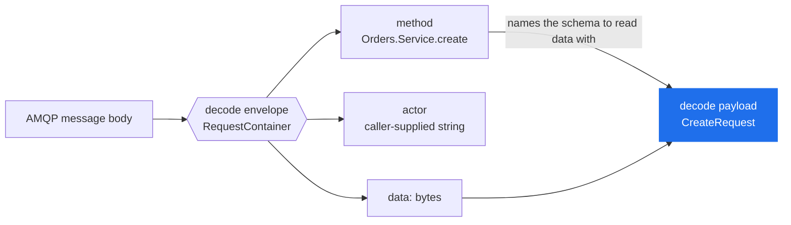
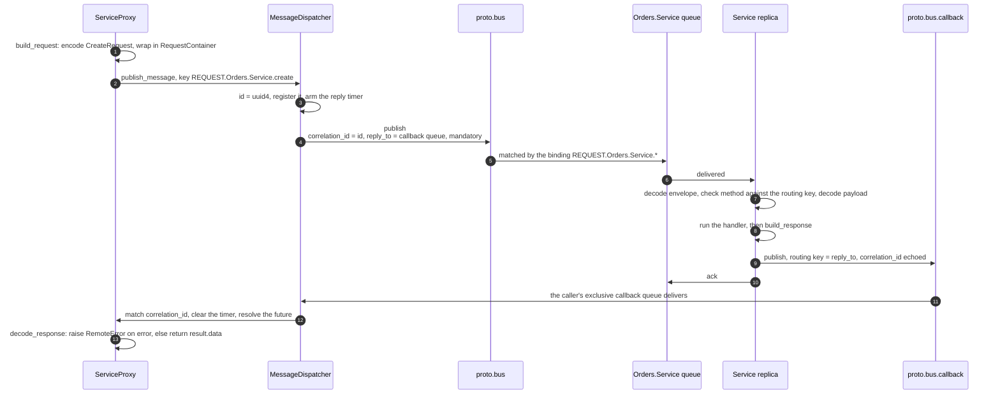
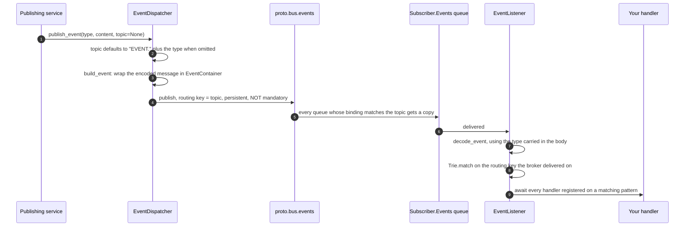

# Message Flow

> The bytes protobus puts on the wire, and one RPC round trip traced through them.

**Read this if** you are looking at a message in the RabbitMQ management UI, writing a client in another language, or you need to know exactly what ties a reply to the call that produced it.

| | |
|---|---|
| **Prerequisites** | [Architecture](./architecture.md) — the exchanges and queues this page moves messages through |
| **Next** | [Delivery Guarantees](./delivery-guarantees.md) · [Events](../guide/events.md) |
| **Source** | [`protobus/message_factory.py`](../../protobus/message_factory.py) · [`protobus/message_dispatcher.py`](../../protobus/message_dispatcher.py) · [`protobus/event_dispatcher.py`](../../protobus/event_dispatcher.py) · [`protobus/trie.py`](../../protobus/trie.py) |

**On this page** — [Two layers](#two-layers) · [The envelope messages](#the-envelope-messages) · [One RPC round trip](#one-rpc-round-trip) · [Correlation and timeouts](#correlation-and-timeouts) · [The event path](#the-event-path) · [Routing-key grammar](#routing-key-grammar) · [Wildcard matching](#wildcard-matching) · [What the envelope costs](#what-the-envelope-costs)

> [!NOTE]
> This page is about the **message**. The exchanges, the four queues a service declares, and the retry/DLQ ladder belong to [Architecture](./architecture.md) and [Delivery Guarantees](./delivery-guarantees.md), and are not repeated here.

---

## Two layers

Every protobus message is protobuf inside protobuf: a fixed **envelope** the bus understands, carrying the **payload** — the opaque bytes of a message from your own schema.



The bus routes, retries, dead-letters and logs a message without ever loading your `.proto`. Only the two endpoints decode the second layer.

That split has a security consequence, and it is the reason the two decodes are separate methods rather than one:

> [!IMPORTANT]
> **`method` is publisher-controlled, and it chooses the schema.** A service therefore decodes the envelope, checks the name it carries against the routing key the broker actually delivered on, and only then decodes the payload — [`protobus/message_service.py`](../../protobus/message_service.py), `_on_message`. Decoding first would let a publisher pick which schema its bytes are parsed as, and hand one service's request to another service's handler.

<details>
<summary><b>The three checks a request passes before a handler sees it</b></summary>

<br/>

From [`protobus/message_service.py`](../../protobus/message_service.py), in order. Each failure is answered with an `InvalidMethodError` rather than retried.

1. The routing key starts with `REQUEST.<service_name>.` — the delivery belongs to this service, judged by what the broker did, not by what the body says.
2. The last segment of the routing key equals the last segment of `envelope.method` — a caller that can publish cannot route to one method and have another run. This is what keeps RabbitMQ topic permissions meaningful.
3. `envelope.method` splits as `<Package>.<Service>.<method>` where `<Package>.<Service>` is this service's contract, and `<method>` is one the contract declares **and** the subclass itself implements.

</details>

---

## The envelope messages

Five messages, none of which lives in a `.proto` file: they are built as descriptors at import time in [`protobus/message_factory.py`](../../protobus/message_factory.py), byte-identical to the ones the TypeScript port declares. Written out as protobuf they read:

```protobuf
syntax = "proto3";

message RequestContainer {
    string method = 1;   // <Package>.<Service>.<method>
    string actor  = 2;   // caller-supplied; tracing only
    bytes  data   = 3;   // encoded request message
}

message ResponseResult {
    string method = 1;   // echoed back; selects the schema for data
    bytes  data   = 2;   // encoded response message
}

message ResponseError {
    string method  = 1;
    string message = 2;
    string code    = 3;  // the code carried by HandledError; "" otherwise
}

message ResponseContainer {
    oneof value {
        ResponseResult result = 1;
        ResponseError  error  = 2;
    }
}

message EventContainer {
    string type  = 1;    // <Package>.<MessageType>
    string topic = 2;    // the topic it was published under
    bytes  data  = 3;    // encoded event message
}
```

| Top-level envelope | Published to | Built by | Read by |
|---|---|---|---|
| `RequestContainer` | `proto.bus` | `build_request` | `decode_request_envelope` then `decode_request_payload` |
| `ResponseContainer` | `proto.bus.callback` | `build_response` | `decode_response` |
| `EventContainer` | `proto.bus.events` | `build_event` | `decode_event` |

> [!NOTE]
> Nothing on the wire decides retry behaviour — the *sending* service decides it, before encoding, by whether the exception was a `HandledError`. See [Delivery Guarantees](./delivery-guarantees.md#the-retry-ladder).

Two details worth knowing about `ResponseError`:

- **`code` is `HandledError`'s code.** `build_response` reads `getattr(error, 'code', '')`, so an ordinary exception yields an empty string. `ServiceProxy` raises a `RemoteError(message, code, method)` on the caller's side.
- **The error path never looks the method up.** Every other encode resolves `method` against the schema; this one treats it as a label. Otherwise a failure that is *about* an unknown method would be impossible to report, and the caller would sit out its whole RPC timeout instead.

`ResponseResult.method` is not decoration either: `decode_response` uses it to find the response type to decode `data` with, so a response is self-describing without the caller having to remember what it asked for.

> [!NOTE]
> `actor` is a caller-supplied string that nothing verifies. It is for tracing, never authorisation — see the [Security model](../operations/security.md).

---

## One RPC round trip



Three things in that sequence are routinely misremembered:

> [!IMPORTANT]
> **The reply's routing key is `reply_to` — the callback queue's name — not the `correlation_id`.** `proto.bus.callback` is a *direct* exchange and each caller's queue is bound to it under its own name ([`protobus/base_listener.py`](../../protobus/base_listener.py), the `direct` branch). The `correlation_id` is an AMQP message property, and it selects the pending future *inside* the caller's process. Two different mechanisms; only one of them is routing.

> [!IMPORTANT]
> **The reply timer is armed before the publish, not after.** `publish()` waits for a broker confirm, and a fast service can answer while that confirm is still in flight. Registering afterwards would let `_on_result` find no entry for the `correlation_id` and drop a reply that had already arrived ([`protobus/message_dispatcher.py`](../../protobus/message_dispatcher.py)).

> [!IMPORTANT]
> **RPC requests are published `mandatory`, events are not.** An RPC request that matches no binding means no service is listening, so it fails immediately with `UnroutableError` instead of after the full timeout. An event with no subscribers is normal, so setting `mandatory` there would break fan-out publishing.

<details>
<summary><b>Fire-and-forget: the same path with <code>rpc=False</code></b></summary>

<br/>

`await proxy.method(request, actor, False)` publishes the identical `RequestContainer` to the identical routing key, and then:

- `reply_to` is left unset, so the service publishes no reply at all,
- `mandatory` is not set, so an unroutable message is silently dropped,
- no correlation entry and no timer are created, and `timeout_ms` is ignored,
- the call returns `{}` as soon as the broker confirms the publish.

A failure in the handler is therefore invisible to the caller. It still takes the full retry ladder on the service side.

</details>

---

## Correlation and timeouts

| | |
|---|---|
| **Correlation id** | `uuid4()`, minted per call in `MessageDispatcher.publish` |
| **Where it lives** | the AMQP `correlation_id` property, echoed unchanged onto the reply |
| **What it selects** | one entry in the dispatcher's `pending_callbacks` map — a future and its timer |
| **Reply queue** | one exclusive, auto-delete queue **per client process**, not per call |
| **Default timeout** | `Config.rpc_call_timeout_ms()` — **600000 ms (10 minutes)**, `RPC_CALL_TIMEOUT_MS` |
| **Per-call override** | the 4th argument to a proxy method, `timeout_ms` |
| **On timeout** | the entry is deleted and the call raises `RpcTimeoutError`, naming the routing key and the correlation id |
| **On disconnect** | every pending entry is failed at once with `DisconnectedError` and the map is cleared — unless the request had not yet been confirmed, in which case it is republished once on the restored channel under the same `message_id` |
| **On caller cancellation** | the entry is released; an `asyncio.CancelledError` never leaks a slot |

> [!CAUTION]
> Ten minutes is a deliberately generous default, chosen so that upgrading protobus could not break a deployment with a legitimately slow handler. It is far too long for anything user-facing. Size it against the whole retry ladder rather than a single handler run: with the defaults a permanently failing call is retried three times at 5 s apart before the caller hears anything — see [The parked caller](./delivery-guarantees.md#the-parked-caller).

---

## The event path

An event is one-way. There is no `reply_to`, no correlation entry, no timer, and no acknowledgement that reaches the publisher.



Two asymmetries with the RPC path decide most event-related surprises:

- **The routing key is the topic, and the topic is what the `Trie` matches.** The listener deliberately prefers `context.routing_key` over the `topic` field inside the body: the body is publisher-controlled, and trusting it would let a publisher reach handlers its routing key was never permitted to reach. The body topic is used only as a fallback when no routing key is available.
- **The `type` field is used for decoding, not for routing.** `decode_event` looks `type` up in the loaded schema to decode `data`. A subscriber that matches a broad wildcard therefore needs every type it can receive present in its own schema, or the decode throws. See [Events](../guide/events.md#topics-route-types-do-not).

---

## Routing-key grammar

| Traffic | Key | Set by | Example |
|---|---|---|---|
| RPC request | `REQUEST.<Package>.<Service>.<method>` | `ServiceProxy`, from the proto | `REQUEST.Orders.Service.create` |
| Service binding | `REQUEST.<Package>.<Service>.*` | `MessageService.init` | one queue serves every method |
| RPC reply | the caller's callback queue name | `connection.py`, from `reply_to` | `amq.gen-JzTY20BRgKO-HjmUJj0wLg` |
| Event, default | `EVENT.<Package>.<MessageType>` | `EventDispatcher.publish` | `EVENT.Orders.OrderCreated` |
| Event, custom topic | whatever you pass | you | `ORDERS.US.SHIPPED` |
| Retry hop | the original request key, preserved | `connection.py` | `REQUEST.Orders.Service.create` |

> [!NOTE]
> **The routing key and the envelope's `method` are allowed to disagree, in one specific way.** `service_name` may carry more segments than the contract does: a class named `Combat.Player.player6` binds `REQUEST.Combat.Player.player6.*`, while the method it serves is still `Combat.Player.shoot` — the contract name, found by trimming segments from the right until one matches a `service` in the schema. That is why check 2 compares only the *last* segment of the routing key with the last segment of `method`.
>
> `ServiceProxy(context, 'Combat.Player.player6')` addresses such an instance directly: it resolves the contract the same way, routes to `REQUEST.Combat.Player.player6.<method>` and names `Combat.Player.<method>` in the envelope — [`sample/combatGame/base_player.py`](../../sample/combatGame/base_player.py), `call_player_method`, is the worked example.

---

## Wildcard matching

Event subscriptions are matched by a [`Trie`](../../protobus/trie.py), not by RabbitMQ, because one queue can carry several subscriptions and the process still has to decide which handlers to run. The grammar is RabbitMQ's:

| Token | Matches |
|---|---|
| `*` | exactly one word |
| `#` | zero or more words |

Words are separated by `.`. A pattern with no wildcard matches only itself.

Register three patterns:

| Pattern | Handler |
|---|---|
| `ORDERS.*.CREATED` | A |
| `ORDERS.#` | B |
| `ORDERS.US.*.SHIPPED` | C |

and this is what the matcher does with them:

| Event | Words | Handlers | Why |
|---|---:|---|---|
| `ORDERS` | 1 | **B** | `#` stands for zero words too; `*` never does |
| `ORDERS.US.CREATED` | 3 | **A, B** | `*` binds the single word `US` |
| `ORDERS.US.123.CREATED` | 4 | **B** | `*` cannot cover `US.123` |
| `ORDERS.US.123.SHIPPED` | 4 | **B, C** | literal `US`, then `*` binds `123` |
| `ORDERS.EU.456.SHIPPED` | 4 | **B** | the literal `US` does not match `EU` |

> [!WARNING]
> The third row is the one that catches people. `ORDERS.*.CREATED` reads as "any order that was created", but `*` is **exactly one** word, so the pattern describes a three-word topic and that event has four. Reach for `#` whenever the number of words can vary.

Those five rows are executed against the real matcher by `TestTrie.test_the_wildcard_example_in_the_docs` in [`tests/unit/test_events_trie_config.py`](../../tests/unit/test_events_trie_config.py). If you change the table, change the test.

<details>
<summary><b>Two behaviours of the trie that are easy to assume wrong</b></summary>

<br/>

- **A pattern is not shadowed by a longer one.** Adding `a.b.c` does not stop `a.b` from matching, because a value is stored only on the node its own pattern ends at, and a node with children can still hold one.
- **Two subscriptions to the same pattern both fire.** Each node holds a list of values, not a slot. An earlier implementation kept one, so a second handler on the same topic was silently dropped.

Unsubscribing is not implemented: the trie has no remove.

</details>

---

## What the envelope costs

Measured, not estimated — encode a `RequestContainer` for the method `Orders.Service.create` (21 characters) and subtract the payload:

| Envelope | actor | Payload | Total | Overhead |
|---|---|---:|---:|---:|
| `RequestContainer` | `""` | 100 B | 125 B | **25 B** |
| `RequestContainer` | `"client-1"` | 100 B | 135 B | **35 B** |
| `ResponseContainer` (result) | — | 100 B | 127 B | **27 B** |
| `EventContainer` | — | 100 B | 150 B | **50 B** |

The overhead is the strings, and it does not grow with the payload: two bytes of protobuf framing plus the length of each string it carries, then one tag byte and a varint length for `data`. `EventContainer` costs more only because it carries two long strings — the type name and the topic — where a request carries one plus an empty `actor`, and proto3 omits a field equal to its default, so an empty `actor` is genuinely zero bytes.

Nothing in protobus compresses or batches. If your payloads are large enough for this to matter, the envelope is not what you should be looking at — see [Streaming](../guide/streaming.md).

---

<div align="center">

**[← Architecture](./architecture.md)** · **[Docs index](../README.md)** · **[Delivery Guarantees →](./delivery-guarantees.md)**

</div>
