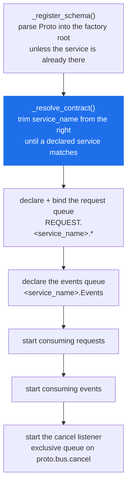
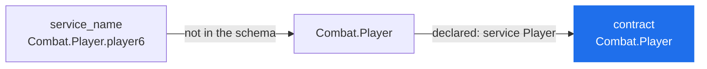
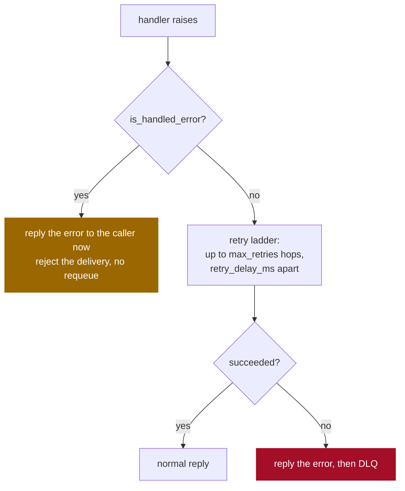

# MessageService

> The base class a service extends. It declares the service's queue, routes each request to one of your methods, and carries the event publish/subscribe pair.

**Read this if** you are writing a service class, or a caller is getting `invalid service method` for a method you can see on the class.

| | |
|---|---|
| **Prerequisites** | [Getting Started](../../guide/getting-started.md) · [Context](./context.md) |
| **Next** | [RunnableService](./runnable-service.md) · [Error Handling](../../guide/error-handling.md) · [Events](../../guide/events.md) |
| **Source** | [`protobus/message_service.py`](../../../protobus/message_service.py) · [`protobus/message_listener.py`](../../../protobus/message_listener.py) · [`protobus/event_listener.py`](../../../protobus/event_listener.py) |

**On this page** — [The class](#the-class) · [Required members](#required-members) · [Constructor options](#constructor-options) · [What init does](#what-init-does) · [The handler contract](#the-handler-contract) · [Instance names](#instance-names-and-the-contract-they-resolve-to) · [Events](#events) · [When a handler raises](#when-a-handler-raises) · [Shutdown](#shutdown) · [Startup errors](#startup-errors)

---

## The class

```python
class MessageService:
    def __init__(self, context: IContext, options: MessageServiceOptions | None = None, **kwargs): ...

    service_name: str                       # class attribute or property; `ServiceName` accepted too
    proto_file_name: str                    # class attribute or property; `ProtoFileName` accepted too
    Proto: str                              # property: reads proto_file_name off disk

    async def init(self) -> None: ...
    async def stop_consuming(self) -> None: ...
    async def close(self) -> None: ...

    async def publish_event(self, event_type: str, content: Any, topic: str | None = None) -> None: ...
    async def subscribe_event(self, event_type: str, handler: EventHandler, topic: str | None = None) -> Any: ...

    context: IContext
    contract_service_name: str | None       # property: the name the .proto declares, once resolved
```

`MessageService` extends **nothing**. It *owns* three listeners as private fields — a `MessageListener` for the request queue, an `EventListener` for the events queue and a `CancelListener` for stream cancellations — which is why none of their members appear on your subclass.

That listing is the entire public surface. There is no `on_initialized`, no `on_before_start`, and no `cleanup()` here; `cleanup()` belongs to [`RunnableService`](./runnable-service.md#cleanup).

---

## Required members

### `service_name`

The name the service is addressed by. It binds `REQUEST.<service_name>.*` on `proto.bus`, and its events queue is `<service_name>.Events`.

It is normally `<Package>.<Service>` exactly as the `.proto` declares it, but it may carry extra segments — see [Instance names](#instance-names-and-the-contract-they-resolve-to). A class attribute, a `@property`, or the TypeScript spelling `ServiceName` all work.

### `proto_file_name`

A path to the `.proto` file declaring this service. The default `Proto` property reads it and raises `MissingProto("missing_proto_source")` if it is not there — but only if the schema is not already in the factory, so a service whose directory was passed to `Context.init()` never reads the file at all. `proto_file_name = ""` with a `Proto` attribute or property supplying the schema text is the pattern the test suite uses.

> [!WARNING]
> A relative path is resolved against the **process working directory**, not against the source file. `os.path.join(os.path.dirname(__file__), "calculator.proto")` is reliable; `"./calculator.proto"` breaks the moment the service is started from anywhere else.

[`RunnableService`](./runnable-service.md#proto_file_name) supplies this by convention, so a subclass of that one only has to declare `service_name`.

### The schema must declare a `service` block

`init()` looks the service up in the loaded schema and reads its declared method names. A `.proto` with only messages in it is not enough.

> [!NOTE]
> This holds even for a service that implements **no RPCs at all** and exists only to subscribe to events. Without a `service` block, `init()` raises `MissingProto` with `no service in the schema matches '<name>' or any prefix of it`. An empty `service Subscriber {}` satisfies it.

---

## Constructor options

`MessageServiceOptions`, a dataclass; every field is also accepted as a keyword argument (`MyService(context, max_concurrent=4)`), but not both at once. None of them is an overridable attribute.

| Option | Type | Default | What it does |
|---|---|---|---|
| `max_concurrent` | `int` | `1` (`DEFAULT_PREFETCH`) | Consumer prefetch: unacked messages this replica holds at once. |
| `retry.max_retries` | `int` | `3` | Redelivery attempts before the DLQ. `0` disables retries. |
| `retry.retry_delay_ms` | `int` | `5000` | Becomes the retry queue's `x-message-ttl`. |
| `retry.message_ttl_ms` | `int` | `None` | TTL on the main queue. Unset means no expiry. |
| `late_ack` | `bool` | `True` | Ack after the handler returns. |
| `processing_timeout_ms` | `int` | `Config.message_processing_timeout()` (`MESSAGE_PROCESSING_TIMEOUT`, 600000) | How long one handler may run before the delivery is abandoned. |
| `max_priority` | `int` | `None` | Declares the request queue as a RabbitMQ priority queue with `x-max-priority`. Integer 1-255. |
| `event_retry` | `EventRetryOptions` | `None` | Opt-in retry ladder for this service's event subscriptions: `max_retries`, `retry_delay_ms`. |

```python
# calculator_service.py
import os

from protobus import Context, MessageService, MessageServiceOptions, RetryOptions


class CalculatorService(MessageService):
    service_name = "Calculator.Math"
    proto_file_name = os.path.join(os.path.dirname(__file__), "proto", "Calculator.proto")

    async def add(self, request: dict, actor: str, correlation_id: str) -> dict:
        return {"result": request["a"] + request["b"]}


def build(context: Context) -> CalculatorService:
    return CalculatorService(context, MessageServiceOptions(
        max_concurrent=10,
        retry=RetryOptions(max_retries=5, retry_delay_ms=2000),
    ))
```

> [!CAUTION]
> **`max_concurrent` defaults to `1`.** One message at a time per replica, the slot held until the handler returns and its reply is away. A service that awaits any I/O and was never configured is leaving nearly all of its throughput unused. A *streaming* handler holds its slot for the whole life of the stream, so a streaming service left on the default serves one caller per replica. Full detail in [Configuration → Concurrency](../configuration.md#concurrency).

> [!WARNING]
> **`late_ack=False` is not a performance setting.** Acking on delivery disables the retry, DLQ and error-reply paths entirely: a failed message is dropped and the caller waits out its full `RPC_CALL_TIMEOUT_MS` for a reply that is never published. Use it only for genuine at-most-once delivery with no error reporting. Combined with `max_priority` it is refused outright.

> [!WARNING]
> **`max_priority` cannot be added to a queue that already exists.** RabbitMQ fixes queue arguments at declare time, so the changed declare fails with `PRECONDITION_FAILED` and `init()` raises — the service does not start. An operator has to drain and delete the main queue first. Read the "Enabling priority on a queue that already exists" section of [Message Priority](../../guide/priority.md) before turning it on. The floor is `1`, not `0`: `x-max-priority: 0` is a plain queue with a priority queue's overhead, so it is refused ([`protobus/priority.py`](../../../protobus/priority.py), `validate_max_priority`).

---

## What `init()` does



Everything after `_resolve_contract()` touches the broker, so a schema problem surfaces before any queue is declared. A failure at any step is logged with the service name and re-raised.

> [!NOTE]
> The service registers its own schema, so passing a proto directory to `Context.init()` is optional. When you do both, the second registration is a no-op rather than a duplicate-type error — the factory keys on the service name *and* on the schema text.

---

## The handler contract

An RPC method is a method on your subclass whose name matches an `rpc` in the contract, **spelled exactly as the `.proto` spells it** — `createOrder` stays `createOrder`. It receives three arguments, or four if it declares a fourth:

| # | Parameter | Type | Notes |
|---|---|---|---|
| 1 | `request` | `dict` | already decoded against the contract's schema |
| 2 | `actor` | `str` | caller-supplied and **unverified**; `""` when the caller passed none |
| 3 | `correlation_id` | `str` | the delivery's correlation id, for logging |
| 4 | `context` | `MessageHandlerContext` | `signal`, `routing_key`, `message_id`, `redelivered`. Passed only to a handler with four positional parameters (or `*args`) |

The fourth is what a long-running or streaming handler needs.

```python
from protobus import MessageHandlerContext, MessageService


class ReportService(MessageService):
    service_name = "Reports.Service"
    proto_file_name = os.path.join(os.path.dirname(__file__), "proto", "Reports.proto")

    async def generate(self, request: dict, actor: str, correlation_id: str, context: MessageHandlerContext) -> dict:
        if context.redelivered:
            # This exact message has been delivered before. message_id is stable
            # across every retry hop, so it is what deduplication keys on.
            Logger.warn(f"redelivery of {context.message_id} for {actor}")

        written = 0
        for _ in range(request["rows"]):
            # The signal fires on the processing timeout and on caller
            # cancellation. Nothing preempts a running coroutine between
            # awaits, so a handler that never checks it simply runs to the end.
            if context.signal.aborted:
                break
            written += 1
        return {"written": written}
```

> [!WARNING]
> **`actor` is not authentication.** The caller sets it and nothing signs or verifies it — any process that can publish to the bus can publish any value. Use it for tracing and audit logging, never to decide whether an operation is permitted. Identity is enforced with per-service broker credentials: [Security model](../../operations/security.md).

### Only methods your subclass defines are dispatchable

The lookup walks the MRO and **stops at the first class from the `protobus` package** ([`protobus/message_service.py`](../../../protobus/message_service.py), `_resolve_own_handler`). A plain `getattr` would resolve an rpc named `init` or `publish_event` to the framework's own member and call it with the caller's arguments; instead such a name resolves to nothing and the caller gets `invalid service method`. Names starting with `_` are never dispatchable.

If a method is on the class and calls still fail, work down this ladder — it is the order `_on_message` checks in, and each step has a distinct message:

| Check | Rejected with |
|---|---|
| the envelope decodes | `request envelope did not decode` |
| the routing key starts with `REQUEST.<service_name>.` | `routing key … does not belong to service …` |
| the body's method matches the routing key's last segment | `request method … contradicts routing key …` |
| the body names a method of *this* contract, spelled in full | `request method … is not a method of …` |
| the contract declares that method | `… declares no method …` |
| your subclass implements it | `invalid service method …` |
| the payload decodes as that method's request type | `payload did not decode as the request type of …` |

<details>
<summary><b>Why the routing key is checked against the body at all</b></summary>

<br/>

The method to run comes out of the message body, which is publisher-controlled. Without the cross-check, a client that can publish to the bus picks which method executes regardless of the routing key it was permitted to publish on — which makes RabbitMQ topic permissions unenforceable, and lets one service's request schema be paired with another service's handler.

The envelope is decoded and checked *before* the payload, because the method name selects the schema the payload is read with.

</details>

### Streaming methods

A method the `.proto` declares `returns (stream …)` must be an async generator (or return an async iterable). Returning a plain coroutine result instead fails the call with `streaming method <name> must return an async iterable`. See [Streaming](../../guide/streaming.md#server-api).

---

## Instance names and the contract they resolve to

`service_name` does not have to be the name the `.proto` declares. `_resolve_contract()` trims dot-separated segments off the right until one matches a `service` in the schema:



This is how several replicas share one schema while each owns a distinct queue: `Combat.Player.player6` binds `REQUEST.Combat.Player.player6.*` and gets its own `Combat.Player.player6.Events`, but its methods and payload types come from `service Player`. [`sample/combatGame`](../../../sample/combatGame) gives every player its own name this way.

> [!NOTE]
> `ServiceProxy` resolves names the same way, so `ServiceProxy(context, "Combat.Player.player6")` addresses that instance directly — it routes to `REQUEST.Combat.Player.player6.<method>` and names `Combat.Player.<method>` in the envelope.

> [!NOTE]
> Trimming stops at the first segment. `Combat.Player.player6` will never resolve against a bare `Combat`, and a name with no dot that is not itself a declared service raises immediately.

---

## Events

### `publish_event(event_type, content, topic=None)`

| Parameter | Description |
|---|---|
| `event_type` | fully-qualified message type from the schema, e.g. `Calculator.CalculationEvent` |
| `content` | `dict` matching that message |
| `topic` | routing key; omitted or empty means `EVENT.<event_type>` |

Publishing does not require the event's type to belong to this service's schema — any type in the factory root will do.

### `subscribe_event(event_type, handler, topic=None)`

The handler is `async (event, event_type, topic) -> None`, or a shorter form — `(event)` or `(event, topic)` — called with what it declares. `topic` is a RabbitMQ topic pattern; omitted, it binds `EVENT.<event_type>`.

> [!IMPORTANT]
> **Subscribe after `init()`, never before.** `subscribe_event` binds a queue using the channel and queue name that `init()` creates, so calling it on a service that has not been initialised fails on a missing channel.

```python
from calculator_service import CalculatorService


async def main(context) -> None:
    service = CalculatorService(context)
    await service.init()          # first

    async def on_audit(event: dict, event_type: str, topic: str) -> None:
        print(f"{event_type} on {topic}", event)

    await service.subscribe_event("Audit.LogEvent", on_audit)

    # Wildcards are RabbitMQ topic patterns: * is one segment, # is any number.
    async def on_us_order(event: dict) -> None:
        print("a US order shipped", event)

    await service.subscribe_event("Orders.OrderEvent", on_us_order, "ORDERS.US.*")
```

The events queue is `<service_name>.Events`: **durable and not auto-delete**. Events published while every replica is down are still there when one comes back — and an events queue belonging to a service you deleted keeps filling forever. See [Queue Migration](../../operations/queue-migration.md).

> [!NOTE]
> There is no `unsubscribe`. The topic trie has no removal path ([`protobus/event_listener.py`](../../../protobus/event_listener.py)). A subscription lasts for the life of the process.

Wildcards, competing subscribers and delivery semantics: [Events](../../guide/events.md).

---

## When a handler raises

The two paths are not variations on each other; they differ in when the caller hears anything.



> [!WARNING]
> **A plain exception does not reach the caller immediately.** No reply is published while a message is being retried. At the defaults — `max_retries=3`, `retry_delay_ms=5000` — a permanently failing call blocks its caller for roughly 15 seconds before the error arrives. Size `RPC_CALL_TIMEOUT_MS` against `max_retries × retry_delay_ms`, not against one handler run.

`HandledError` is the way to say "this is a business outcome, not an infrastructure failure". Its `message` and `code` always cross the wire, and it is never retried.

```python
from protobus import HandledError, MessageService


class NotFoundError(HandledError):
    def __init__(self, id: str):
        super().__init__(f"order {id} not found", "NOT_FOUND")


class OrderService(MessageService):
    service_name = "Orders.Service"
    proto_file_name = os.path.join(os.path.dirname(__file__), "proto", "Orders.proto")

    async def get(self, request: dict, actor: str, correlation_id: str) -> dict:
        if not request.get("orderId"):
            # Answered at once. Retrying a request with no id cannot help.
            raise HandledError("orderId is required", "VALIDATION_ERROR")

        order = await self.load(request["orderId"])
        if order is None:
            raise NotFoundError(request["orderId"])

        # An exception from here — a dropped database connection, say — is an
        # infrastructure failure and DOES go round the retry ladder.
        return {"total": order["total"]}

    async def load(self, id: str) -> dict | None:
        return {"total": 0}
```

An unhandled error's message is sanitized before it is sent to the caller if `PROTOBUS_EXPOSE_INTERNAL_ERRORS=false`; the unsanitized error still goes to this service's own log. Full treatment in [Error Handling](../../guide/error-handling.md) and [Errors](../errors.md).

---

## Shutdown

`stop_consuming()` stops the request and event consumers and closes the cancel listener, leaving channels open so work already in hand can finish. It is the first step of a graceful shutdown, not the whole of it. `close()` is the whole of it for one service: it stops consuming and closes the service's channels.

```python
async def shutdown(context, service) -> None:
    await service.stop_consuming()                        # no new work
    await context.connection.drain_in_flight(30000)       # let current work finish
    await service.close()                                 # release the service's channels
    await context.close()                                 # then close the socket
```

[`RunnableService.start`](./runnable-service.md#runnableservicestartcontext-service_class-options-post_init-option_kwargs) does exactly this on SIGINT/SIGTERM, with a `cleanup()` hook between the drain and the disconnect. Use it unless something else owns the process lifecycle.

---

## Startup errors

| Raised | Meaning | Fix |
|---|---|---|
| `MissingProto("missing_proto_source")` | `proto_file_name` does not exist as a file, and the schema was not loaded by `Context.init()` | use an absolute path; check the process working directory |
| `MissingProto("no service in the schema matches …")` | the schema loaded but declares no matching `service` block, at any prefix | add the `service` block, or correct `service_name` |
| `RetryQueueMismatchError` | `retry_delay_ms` changed on a service whose retry queue already exists | drain and delete `<Service>.Retry`, or keep the old value |
| `InvalidPriorityError` | `max_priority` is not an integer 1-255 | see [Message Priority](../../guide/priority.md) |
| `PRECONDITION_FAILED` on `queue.declare` | `max_priority` added to an existing queue | [Queue Migration](../../operations/queue-migration.md) |

Full catalogue with the exact messages: [Errors](../errors.md#startup-errors).

---

<div align="center">

**[← Context](./context.md)** · **[Docs index](../../README.md)** · **[RunnableService →](./runnable-service.md)**

</div>
