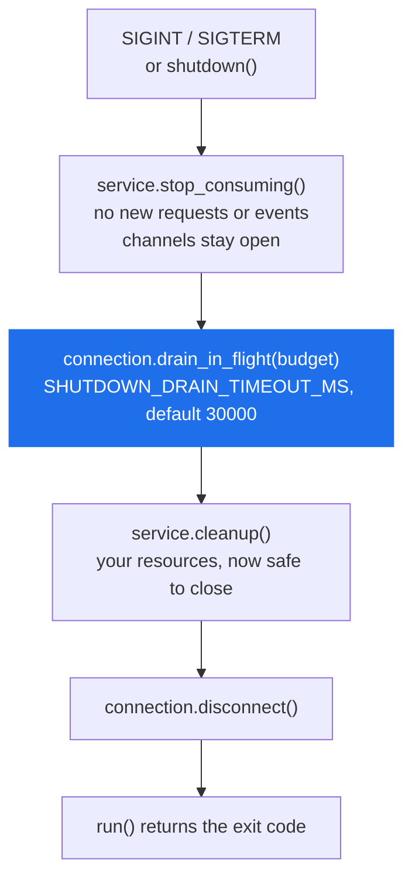

# RunnableService

> `MessageService` plus the process it runs in: a proto filename by convention, signal handling, an ordered drain on shutdown, and a non-zero exit when startup fails.

**Read this if** you are writing the entry point of a service process, or an orchestrator is reporting a service that failed to boot as a clean exit.

| | |
|---|---|
| **Prerequisites** | [MessageService](./message-service.md) — everything there applies here |
| **Next** | [ServiceProxy](./service-proxy.md) · [Patterns](../../guide/patterns.md) · [Configuration](../configuration.md) |
| **Source** | [`protobus/runnable_service.py`](../../../protobus/runnable_service.py) · [`protobus/message_service.py`](../../../protobus/message_service.py) · [`protobus/connection.py`](../../../protobus/connection.py) |

**On this page** — [What it adds](#what-it-adds) · [proto_file_name](#proto_file_name) · [cleanup](#cleanup) · [start / launch](#runnableservicestartcontext-service_class-options-post_init-option_kwargs) · [run / shutdown](#run-and-shutdown) · [The shutdown sequence](#the-shutdown-sequence) · [Exit codes](#exit-codes) · [When to use which](#when-to-use-which)

---

## What it adds

`RunnableService` is a subclass of [`MessageService`](./message-service.md) with the same constructor. Six additions, and nothing else:

| Addition | Kind | Effect |
|---|---|---|
| `proto_file_name` | concrete property | derived from `service_name`, so a subclass declares only `service_name` |
| `cleanup()` | hook | a no-op you override; called during shutdown |
| `RunnableService.start()` | classmethod | construct, `init()`, install signal handlers, block until shutdown |
| `RunnableService.launch()` | classmethod | the same without blocking: returns the running service |
| `run()` / `shutdown()` / `request_shutdown()` | methods | the pieces `start()` is made of, for a process that owns its loop |
| the shutdown sequence | behaviour | stop consuming, drain, clean up, disconnect |

Everything else — `init()`, `publish_event`, `subscribe_event`, `stop_consuming()`, the handler contract, the retry ladder — is inherited unchanged from [`MessageService`](./message-service.md).

```python
# calculator_service.py
from protobus import RunnableService


class CalculatorService(RunnableService):
    # The only required member. proto_file_name comes by convention.
    service_name = "Calculator.Math"

    async def add(self, request: dict, actor: str, correlation_id: str) -> dict:
        return {"result": request["a"] + request["b"]}
```

---

## `proto_file_name`

```python
@property
def proto_file_name(self) -> str:
    package_name = self.service_name.split(".")[0] or self.service_name
    return os.path.join(os.environ.get("PROTO_PATH", "./proto"), f"{package_name}.proto")
```

The rule is the **first** dot-separated segment — the package — plus `.proto`, inside `PROTO_PATH` (default `./proto`). It is not "the service name with the last segment replaced", which is what the derivation looks like on a two-segment name and is not what it does on any other.

| `service_name` | `proto_file_name` |
|---|---|
| `Calculator.Math` | `./proto/Calculator.proto` |
| `Notifications.Service` | `./proto/Notifications.proto` |
| `Combat.Player.player6` | `./proto/Combat.proto` |
| `Orders` | `./proto/Orders.proto` |

> [!WARNING]
> The result is **relative to the process working directory**, not to the source file. A service that runs from the repo root and fails from somewhere else is hitting this, and the error is only `MissingProto: missing_proto_source`.

Two ways out. Either pass the proto directory to [`Context.init()`](./context.md#initamqp_connection_string-proto_locations-options), which loads the schema before the service's own `Proto` property is ever consulted — the file is then never read:

```python
context = Context()
# The schema is in the root before any service asks for it, so the
# convention-derived filename is never read from disk.
await context.init("amqp://localhost", [os.path.join(HERE, "proto")])
```

Or set the attribute to an absolute path:

```python
import os

from protobus import RunnableService


class ReportService(RunnableService):
    service_name = "Reports.Service"
    # Absolute, and relative to this file rather than to the process.
    proto_file_name = os.path.join(os.path.dirname(__file__), "proto", "Reports.proto")
```

---

## `cleanup()`

```python
async def cleanup(self) -> None
```

A no-op you override to release resources the framework knows nothing about. It runs **after** consumers have stopped and in-flight work has drained, so a request can never arrive after you have closed a database handle.

```python
from protobus import RunnableService


class OrderService(RunnableService):
    service_name = "Orders.Service"

    async def init(self) -> None:
        self.pool = await create_pool()
        await super().init()

    async def create(self, request: dict, actor: str, correlation_id: str) -> dict:
        return {"id": str(request["total"])}

    async def cleanup(self) -> None:
        await self.pool.close()
```

> [!NOTE]
> An exception from `cleanup()` is caught and logged; it does not abort the shutdown or change the exit code. The connection is closed either way.

---

## `RunnableService.start(context, service_class, options, post_init, **option_kwargs)`

```python
@classmethod
async def start(cls, context, service_class=None, options=None, post_init=None, **option_kwargs) -> T
@classmethod
async def launch(cls, context, service_class=None, options=None, post_init=None, **option_kwargs) -> T
```

| Parameter | Description |
|---|---|
| `context` | an **already initialised** context. Neither method calls `context.init()`. |
| `service_class` | the class to construct. Defaults to `cls`, so `CalculatorService.start(context)` is the usual spelling; `RunnableService.start(context, CalculatorService)` is the TypeScript-style one. |
| `options` | a `MessageServiceOptions`, forwarded to the constructor — see [Constructor options](./message-service.md#constructor-options) |
| `post_init` | a coroutine function called with the service after `init()` and before the "Service ready" log. An exception here takes the startup-failure path. |
| `**option_kwargs` | the fields of `MessageServiceOptions` as keywords (`max_concurrent=4`), instead of `options`; not both |

`launch()` returns the running service. `start()` is `launch()` followed by [`run()`](#run-and-shutdown): it blocks until a shutdown signal, then returns the service, whose `exit_code` says how it ended.

```python
# server.py
import asyncio
import os

from protobus import Context
from calculator_service import CalculatorService


async def main() -> None:
    context = Context()
    await context.init(os.environ.get("AMQP_URL", "amqp://localhost"), [os.path.join(HERE, "proto")])

    async def subscribe(service: CalculatorService) -> None:
        async def on_audit(event: dict) -> None:
            print("audit", event)

        await service.subscribe_event("Audit.LogEvent", on_audit)

    await CalculatorService.start(context, max_concurrent=10, post_init=subscribe)


asyncio.run(main())
```

> [!TIP]
> `post_init` is where event subscriptions belong when you would rather not override `init()`. `subscribe_event` needs the channel and queue that `init()` creates, so it cannot run any earlier, and `post_init` is the first callback after `init()` returns.

---

## `run()` and `shutdown()`

For a process that owns its own loop — one that hosts several services, or has other work to do alongside — the pieces are available separately:

| Method | What it does |
|---|---|
| `run()` | installs the signal handlers and blocks until `shutdown()` completes; returns the exit code |
| `shutdown(reason="", exit_code=0)` | the [shutdown sequence](#the-shutdown-sequence), once; a second call is a no-op |
| `request_shutdown(reason="requested")` | schedules `shutdown()` from synchronous code — a health-check handler, a watchdog |
| `exit_code` | property: `0` for a signal-initiated shutdown, `1` when startup failed |

```python
service = await CalculatorService.launch(context, max_concurrent=4)
# ... the process does other things ...
await service.shutdown("deploy")     # ordered drain, then disconnect
```

Signal handlers are shared: asyncio keeps one handler per signal per loop, so every service inside `run()` registers with a single handler that shuts all of them down. Two services started in the same process both stop on one Ctrl-C, and the loop's handler is removed with the last service to leave `run()`. On Windows, or off the main thread, no handler can be installed and `run()` waits for `request_shutdown()` instead.

---

## The shutdown sequence

SIGINT (Ctrl-C) and SIGTERM (a container stop) both run this. It is re-entrant-guarded, so a second signal during shutdown is ignored.



The order is load-bearing at every step:

- **Stop before drain.** `cleanup()` running while consumers still deliver means a request can arrive after your resources are closed.
- **Drain before cleanup.** The drain waits for the reply, retry or DLQ publish that *settles* each in-flight message, not merely for the handler to return.
- **The drain is bounded.** If the budget expires, the remaining deliveries stay unacknowledged and RabbitMQ redelivers them to another replica. The log says so explicitly: `Drain deadline reached with N still running; they stay unacknowledged and will be redelivered`.
- **Nothing calls `sys.exit()`.** `run()` returns and `asyncio.run()` finishes normally, so pending output is flushed and your `main()` can do its own teardown.

---

## Exit codes

| Situation | `service.exit_code` | process |
|---|---|---|
| SIGINT or SIGTERM | `0` | `asyncio.run()` returns; exit 0 |
| `service_class(...)`, `init()` or `post_init` raised | `1` | the exception propagates out of `start()` / `launch()`; an unhandled exception exits non-zero |

> [!IMPORTANT]
> The non-zero exit on a failed startup is the point. Exiting 0 tells Kubernetes and systemd the process succeeded, so a service that could not start is never restarted and never alerts. On that path `launch()` runs the full shutdown sequence with `exit_code=1` and re-raises — so your own `except` around `main()` still sees the original error, and a bare `asyncio.run(main())` exits 1 with a traceback.

---

## When to use which

| | `MessageService` | `RunnableService` |
|---|---|---|
| `proto_file_name` | you set it | derived from `service_name`, overridable |
| SIGINT / SIGTERM | you install handlers | installed by `run()` |
| Drain on shutdown | you call `stop_consuming()` + `drain_in_flight()` | ordered for you |
| Cleanup hook | none | `cleanup()` |
| Bootstrap helper | none | `start()` / `launch()` |
| Exit code on boot failure | yours to set | `1`, and the exception re-raised |

Use `RunnableService` for anything that owns its process — which is most services. Use `MessageService` when something else owns the lifecycle: a test harness, a DI container, or a process running several services where you want one shutdown path rather than one per service.

<details>
<summary><b>Running a RunnableService without <code>start()</code></b></summary>

<br/>

Nothing forces you through `start()`. Constructing and calling `init()` yourself gives you the convention-based `proto_file_name` and the `cleanup()` hook without the signal handling — you then own the ordering described above, or call `shutdown()` to get it.

```python
from calculator_service import CalculatorService


async def run(context) -> None:
    service = CalculatorService(context, max_concurrent=4)
    await service.init()

    # ... and on the way out, in this order:
    await service.stop_consuming()
    await context.connection.drain_in_flight(30000)
    await service.cleanup()
    await context.close()
```

</details>

---

<div align="center">

**[← MessageService](./message-service.md)** · **[Docs index](../../README.md)** · **[ServiceProxy →](./service-proxy.md)**

</div>
