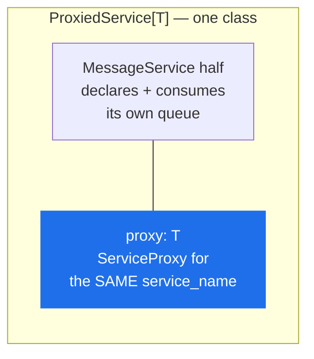

# ServiceProxy

> A client for one remote service. At `init()` it reads that service's contract out of the loaded schema and installs one stub per `rpc`.

**Read this if** you are calling a service, or a type-checker is refusing a method you can see in the `.proto`.

| | |
|---|---|
| **Prerequisites** | [Context](./context.md) — an initialised context with the schema loaded |
| **Next** | [Errors](../errors.md) · [Streaming](../../guide/streaming.md) · [Message Priority](../../guide/priority.md) |
| **Source** | [`protobus/service_proxy.py`](../../../protobus/service_proxy.py) · [`protobus/message_dispatcher.py`](../../../protobus/message_dispatcher.py) · [`protobus/proxied_service.py`](../../../protobus/proxied_service.py) |

**On this page** — [The class](#the-class) · [Typing the call sites](#typing-the-call-sites) · [Unary calls](#unary-calls) · [Streaming calls](#streaming-calls) · [Timeouts](#timeouts) · [Errors](#errors) · [ProxiedService](#proxiedservicet) · [Instance names](#instance-names) · [Reuse the proxy](#reuse-the-proxy)

---

## The class

```python
class ServiceProxy:
    def __init__(self, context: IContext, service_name: str): ...
    async def init(self) -> None: ...

    service_name: str                  # what was passed in
    contract_service_name: str | None  # what the .proto declares, once resolved
    is_initialized: bool
    context: IContext
```

That is the whole of the declared surface. The methods you actually call are assigned onto the instance during `init()`, one per `rpc` in the contract, **named exactly as the `.proto` names them** — `createOrder`, not `create_order`.

> [!IMPORTANT]
> A type-checker cannot see the stubs: they exist at runtime only. `proxy.add(...)` is `Any` to mypy and pyright. This is a real limitation of the class, not a style preference. See [Typing the call sites](#typing-the-call-sites).

### `init()`

`init()` looks `service_name` up in the context's proto root and installs a stub for every method the contract declares. It does **not** set up the callback listener: the reply queue belongs to the context's `MessageDispatcher` and was created by [`Context.init()`](./context.md#initamqp_connection_string-proto_locations-options).

| Condition | Result |
|---|---|
| called twice on one instance | `AlreadyInitializedError` |
| `service_name` matches no service in the loaded schema, at any prefix | `InvalidServiceNameError` |
| a proto method's name collides with a `ServiceProxy` member | `InvalidServiceNameError`, naming the method |

The collision check exists because the stubs are assigned straight onto the instance: an `rpc` named `init`, `context` or `service_name` would silently clobber the proxy's own member. It fails loudly at `init()` instead, telling you to rename the method in the `.proto`.

---

## Typing the call sites

Two honest forms.

**Preferred — annotate with a `Protocol`.** The call site stays type-checked, and `protobus generate` writes the `Protocol` for you ([CLI](../cli.md)).

```python
# client.py
import asyncio
import os
from typing import Optional, Protocol, TypedDict

from protobus import CallOptions, Context, ServiceProxy


class AddRequest(TypedDict, total=False):
    a: int
    b: int


class AddResponse(TypedDict, total=False):
    result: int


class CalculatorMath(Protocol):
    async def add(self, request: AddRequest, actor: Optional[str] = None, rpc: bool = True, timeout_ms: Optional[int] = None, options: Optional[CallOptions] = None) -> AddResponse: ...


async def main() -> None:
    context = Context()
    await context.init(os.environ.get("AMQP_URL", "amqp://localhost"), [os.path.join(HERE, "proto")])

    calculator: CalculatorMath = ServiceProxy(context, "Calculator.Math")  # type: ignore[assignment]
    await calculator.init()  # type: ignore[attr-defined]

    response = await calculator.add({"a": 10, "b": 20})
    print(f"10 + 20 = {response['result']}")

    # A client that does not close its context never exits: the open AMQP
    # socket and its heartbeat hold the event loop open.
    await context.close()


asyncio.run(main())
```

**Blunter — leave it untyped.** What [`sample/tokenStream/streaming_demo.py`](../../../sample/tokenStream/streaming_demo.py) does. One line shorter, and every call site unchecked.

```python
assistant = ServiceProxy(context, "Chat.Assistant")
await assistant.init()
```

> [!TIP]
> If the `type: ignore` on the assignment bothers you, keep two names: `proxy = ServiceProxy(...)` for `init()`, and `calculator: CalculatorMath = proxy  # type: ignore[assignment]` for the calls.

---

## Unary calls

```python
async def method_name(
    request: RequestType,
    actor: str | None = None,
    rpc: bool = True,
    timeout_ms: int | None = None,
    options: CallOptions | None = None,
    *,
    priority: int | None = None,      # 1.x keyword, folded into options
    message_id: str | None = None,    # 1.x keyword, folded into options
) -> ResponseType
```

| Parameter | Default | Behaviour |
|---|---|---|
| `request` | — | `dict` matching the request message |
| `actor` | `None` | caller-supplied string, forwarded verbatim to the handler. **Not authenticated.** |
| `rpc` | `True` | `False` means fire-and-forget: publish and do not wait |
| `timeout_ms` | `Config.rpc_call_timeout_ms()` (`RPC_CALL_TIMEOUT_MS`, 600000) | raises `RpcTimeoutError` |
| `options.priority` | unset | AMQP priority, integer 0-255 |
| `options.message_id` | a fresh UUID | the message identity the consumer sees. Set it to make a caller-driven republish recognisable after an ambiguous outcome — see [Deduplicating a caller's own republish](../../concepts/delivery-guarantees.md#deduplicating-a-callers-own-republish). Blank, or over 255 bytes, is refused with `InvalidMessageIdError` |

> [!WARNING]
> **With `rpc=False` the call returns `{}`**, not the service's response. Nothing is waited for and nothing is decoded. Indexing the result of a fire-and-forget call raises `KeyError`.

```python
from protobus import CallOptions, Config, ServiceProxy

audit = ServiceProxy(context, "Audit.Service")
await audit.init()

# Fire-and-forget: returns once the broker confirms the publish. The
# returned value is {} — there is no reply to decode.
await audit.record({"event": "login"}, "user-123", False)

# A control message that should overtake a bulk backlog. Only has an
# effect on a queue the service declared with max_priority.
await audit.record({"event": "shutdown"}, "ops", True, 5000, CallOptions(priority=Config.PRIORITY_CONTROL))
```

`options.priority` only changes delivery order on a queue whose service declared `max_priority`; on any other queue the broker ignores it without error, which is what lets an upgraded caller talk to a service that has not been upgraded. Prefer the named levels — `Config.PRIORITY_NORMAL` (0), `Config.PRIORITY_HIGH` (1), `Config.PRIORITY_CONTROL` (2) — over bare integers. See [Message Priority](../../guide/priority.md).

> [!NOTE]
> An RPC publish is `mandatory`, so a call to a service with nothing bound to its routing key fails at once with `UnroutableError` rather than after the full 10-minute timeout.

---

## Streaming calls

A method the `.proto` declares as `returns (stream …)` gets a different stub, decided at `init()` from the schema:

```python
def method_name(
    request: RequestType,
    actor: str | None = None,
    idle_timeout_ms: int | None = None,
    options: StreamOptions | None = None,
) -> StreamingCall            # an async iterator, also an async context manager
```

It is **not** a coroutine — there is nothing to await before the `async for`, and the third and fourth parameters are not the unary ones. `idle_timeout_ms` defaults to `Config.stream_idle_timeout_ms()` (`STREAM_IDLE_TIMEOUT_MS`, 60000) and bounds the gap *between* chunks, not the stream's total duration.

```python
from protobus import AbortController, ServiceProxy, StreamOptions

assistant = ServiceProxy(context, "Chat.Assistant")
await assistant.init()

stop = AbortController()

# No await on the call itself; the iterator is returned synchronously.
async with assistant.generate({"prompt": "hello"}, "user-123", 30000, StreamOptions(signal=stop.signal)) as tokens:
    async for token in tokens:
        print(token["text"], end="", flush=True)
```

Use the stream as an `async with` block (or call `await stream.aclose()`) when you might leave the loop early: Python does not close an async iterator on `break`, and closing it is what tells the server to stop producing.

> [!NOTE]
> `StreamOptions` has no `priority` field on purpose. Priority is not supported on streaming calls, and the absence makes passing one a `TypeError` rather than a silent drop — the two option classes sit in different argument slots and are easy to confuse at a call site.

Cancellation, backpressure and the wire protocol: [Streaming](../../guide/streaming.md).

---

## Timeouts

> [!IMPORTANT]
> A caller's timeout is **`RPC_CALL_TIMEOUT_MS`**, default `600000` (10 minutes). It is not `MESSAGE_PROCESSING_TIMEOUT`. The two are separate settings with separate defaults that happen to coincide.

| Setting | Applies to | Default | Raised as |
|---|---|---|---|
| `RPC_CALL_TIMEOUT_MS` | the **caller** waiting for a reply | 600000 | `RpcTimeoutError` |
| `MESSAGE_PROCESSING_TIMEOUT` | the **server** handler's own run | 600000 | the handler is cancelled and its `signal` aborts; the failure climbs the retry ladder |
| `STREAM_IDLE_TIMEOUT_MS` | the gap between streaming chunks | 60000 | `StreamTimeoutError` |

Setting `MESSAGE_PROCESSING_TIMEOUT=30000` does nothing whatsoever to how long your client waits.

```bash
export RPC_CALL_TIMEOUT_MS=30000   # every caller in this process waits 30s
```

Per call, pass `timeout_ms` as the fourth argument. Size it against the retry ladder, not against one handler run: no reply is published while a message is being retried, so at the service's defaults (`max_retries=3`, `retry_delay_ms=5000`) a permanently failing call takes roughly 15 seconds to produce its error.

```python
from protobus import RpcTimeoutError, ServiceProxy, UnroutableError

calculator = ServiceProxy(context, "Calculator.Math")
await calculator.init()

try:
    await calculator.add({"a": 1, "b": 2}, None, True, 30000)
except RpcTimeoutError:
    # Nobody replied in 30s. The request may still be being processed.
    print("no reply in time")
except UnroutableError:
    # Nothing is bound to REQUEST.Calculator.Math.add at all.
    print("no service is listening")
```

Full catalogue: [Errors](../errors.md).

---

## Errors

The stub can raise in five distinguishable ways.

| Raised | When |
|---|---|
| `InvalidRequestError` | the request dict did not encode against the schema — a wrong type, an unknown enum name. `__cause__` names the field |
| a publish error (`UnroutableError`, `PublishNackedError`, `PublishConfirmTimeoutError`, `ChannelClosedError`) | the request never reached a queue |
| `RpcTimeoutError` / `DisconnectedError` | the request went out but no reply came back |
| `RemoteError` | the service answered with an error |
| `InvalidResponseError` | a reply arrived that did not decode, or carried neither a result nor an error |

> [!WARNING]
> **A service-side error arrives as a `RemoteError`, not as the class the service raised.** Only `message`, `code` and `method` cross the wire, so `isinstance(err, HandledError)` on the caller is always `False`. Branch on `error.code` — that is the field the service's `HandledError` subclass controls and the only part that survives the trip.

```python
from protobus import RemoteError, ServiceProxy


async def divide(context, a: int, b: int) -> dict:
    calculator = ServiceProxy(context, "Calculator.Math")
    await calculator.init()

    try:
        return await calculator.divide({"a": a, "b": b})
    except RemoteError as error:
        # The code came from `HandledError(msg, "DIVIDE_BY_ZERO")` on the
        # service. The class did not survive the encoding; the code did.
        if error.code == "DIVIDE_BY_ZERO":
            return {"result": 0}
        raise
```

The publish errors split into two groups that need different handling: `UnroutableError` and `PublishNackedError` are definite failures and safe to retry, while `PublishConfirmTimeoutError` and `ChannelClosedError` are **ambiguous** — the broker may have stored the message and lost only the confirm — so retrying either can duplicate. Both carry the stable `message_id` that makes deduplication possible.

---

## `ProxiedService[T]`

`ProxiedService` is **not** a standalone typed client, and it is not a wrapper you hand a `ServiceProxy` to. It is a [`MessageService`](./message-service.md) that also builds a proxy **for its own `service_name`** during `init()`, exposed as `self.proxy`.



Its constructor is `MessageService`'s, so a subclass supplies `service_name` and `proto_file_name` and nothing else. `init()` calls `super().init()` first, which means declaring the request queue, the events queue and the cancel queue, and starting to consume all three. `self.proxy` raises `RuntimeError` before `init()`.

```python
from protobus import ProxiedService


class CalculatorNode(ProxiedService[CalculatorMath]):
    service_name = "Calculator.Math"
    proto_file_name = os.path.join(HERE, "proto", "Calculator.proto")

    # Serves the contract...
    async def add(self, request: dict, actor: str, correlation_id: str) -> dict:
        return {"result": request["a"] + request["b"]}

    # ...and can call it on a sibling replica, typed.
    async def add_via_peer(self, a: int, b: int) -> int:
        response = await self.proxy.add({"a": a, "b": b})
        return response["result"]
```

> [!CAUTION]
> Using `ProxiedService` for a pure caller starts a **server**. The process declares a queue named after the service it wanted to call, binds `REQUEST.<service_name>.*` and begins competing for that service's traffic — requests meant for the real service are consumed by your client and answered with `invalid service method`. For a caller, use `ServiceProxy`.

The right use is a service calling its own interface: fanning work out to sibling replicas, or a node that both serves and delegates.

---

## Instance names

A service's runtime name is not always the name its `.proto` declares. Several instances share one contract and are addressed under distinct names — `Combat.Player.player6` serving the contract `Combat.Player` — which is how [`MessageService`](./message-service.md#instance-names-and-the-contract-they-resolve-to) resolves its own `service_name`.

`ServiceProxy` resolves the same way, by trimming trailing segments until one names a service in the schema, so an instance-named service is reached like any other:

```python
player6 = ServiceProxy(context, "Combat.Player.player6")
await player6.init()
await player6.shoot({"target": target}, "player1")
```

The two names play different parts, which is why one string could not serve both:

| | Name used | Why |
|---|---|---|
| routing key | the **runtime** name — `REQUEST.Combat.Player.player6.shoot` | it has to reach *this instance's* queue |
| request envelope | the **contract** method — `Combat.Player.shoot` | it is what the receiving `MessageService` validates the body against, and what selects the schema the payload is read with |

They are identical whenever the proxy was constructed with a plain contract name, so nothing changes for the ordinary case. `proxy.contract_service_name` tells you which contract was resolved. [`sample/combatGame/base_player.py`](../../../sample/combatGame/base_player.py) (`call_player_method`) keeps one proxy per target player this way.

A name matching no service at any prefix fails at `init()` with `InvalidServiceNameError`.

---

## Reuse the proxy

`init()` is not free — it walks the contract and builds a closure per method — and it can only be called once per instance. Construct one proxy per service per process and hold it.

```python
import asyncio

from protobus import Context, ServiceProxy


class Clients:
    def __init__(self, context: Context):
        self.users = ServiceProxy(context, "Users.Service")
        self.orders = ServiceProxy(context, "Orders.Service")

    async def init(self) -> None:
        # They share one context, so one connection and one callback queue.
        await asyncio.gather(self.users.init(), self.orders.init())
```

A service that calls other services does the same thing, initialising its proxies after `super().init()`:

```python
from protobus import Context, MessageService, ServiceProxy


class OrderService(MessageService):
    service_name = "Orders.Service"
    proto_file_name = os.path.join(HERE, "proto", "Orders.proto")

    def __init__(self, context: Context):
        super().__init__(context, max_concurrent=10)
        self.payments = ServiceProxy(context, "Payments.Service")

    async def init(self) -> None:
        await super().init()
        await self.payments.init()

    async def create(self, request: dict, actor: str, correlation_id: str) -> dict:
        await self.payments.charge({"amount": request["total"]})
        return {"orderId": "o-1"}
```

> [!TIP]
> A service that calls another service holds its consumer slot for the whole round trip. With `max_concurrent=1` — the default — one outstanding downstream call is the entire capacity of the replica. Raise it, or the chain serialises.

---

<div align="center">

**[← RunnableService](./runnable-service.md)** · **[Docs index](../../README.md)** · **[Errors →](../errors.md)**

</div>
