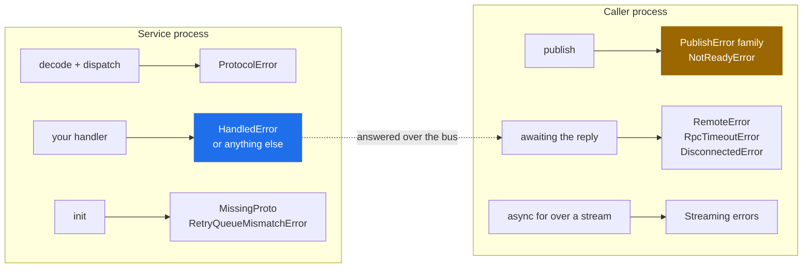
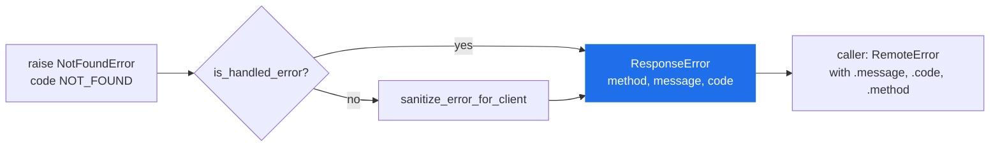

# Errors

> Every error class protobus exports, the exact condition that produces it, and whether retrying is safe.

**Read this if** you are writing an `except` block, or you have an error in a log and want to know which side of the bus produced it.

| | |
|---|---|
| **Prerequisites** | [Error Handling](../guide/error-handling.md) — the retriable/terminal split |
| **Next** | [Custom Types](./custom-types.md) · [Configuration](./configuration.md) |
| **Source** | [`protobus/errors.py`](../../protobus/errors.py) · [`protobus/connection.py`](../../protobus/connection.py) · [`protobus/message_dispatcher.py`](../../protobus/message_dispatcher.py) · [`protobus/message_listener.py`](../../protobus/message_listener.py) · [`protobus/priority.py`](../../protobus/priority.py) · [`protobus/service_proxy.py`](../../protobus/service_proxy.py) |

**On this page** — [Which error am I looking at](#which-error-am-i-looking-at) · [Where each one comes from](#where-each-one-comes-from) · [Service-side errors](#service-side-errors) · [Caller-side errors](#caller-side-errors) · [Publish errors](#publish-errors) · [Streaming errors](#streaming-errors) · [Startup errors](#startup-errors) · [Writing your own terminal errors](#writing-your-own-terminal-errors) · [What crosses the wire](#what-crosses-the-wire)

---

## Which error am I looking at

Every row is verified against the class in [`protobus/errors.py`](../../protobus/errors.py) or the module named in the third column. **`code`** is the `code` attribute on the instance, which is also what travels to the caller in the response envelope; a dash means the class does not set one.

| Error | `code` | Raised by | Retried? | What to do |
|---|---|---|---|---|
| `HandledError` | `HANDLED_ERROR` * | your handler | **never** — answered to the caller at once | nothing; this is the deliberate path |
| `ProtocolError` | `PROTOCOL_ERROR` | `MessageService` on an undecodable or misaddressed request | **never** — a `HandledError` | fix the caller or the schema; the same bytes fail identically forever |
| `InternalServiceError` | `INTERNAL_ERROR` | the error boundary, replacing an unhandled exception | the *original* error was retried to exhaustion first | join the `correlationId` in the message to the service's own log |
| `TimeoutError` (protobus's) | `PROCESSING_TIMEOUT` | the connection layer, when a handler outruns `MESSAGE_PROCESSING_TIMEOUT` | yes — it climbs the ladder | the handler is slower than its budget |
| `RemoteError` | whatever the service sent | `ServiceProxy`, in the **caller**, for any error a service answered with | no | switch on `.code` |
| `RpcTimeoutError` | `RPC_TIMEOUT` | `MessageDispatcher`, in the **caller** | no | read `.published`: `False` never left, `True` confirmed but unanswered, `None` ambiguous |
| `DisconnectedError` | — | `MessageDispatcher`, when the socket drops mid-call | no | the outcome is unknown; reissue only if the call is idempotent |
| `NotReadyError` | `NOT_READY` | `Connection.when_ready()` | no | nothing was published — safe to retry |
| `ReconnectionError` | — | `Connection`, on giving up or being torn down mid-restore | no | the connection is finished; build a new one or exit |
| `PublishNackedError` | `PUBLISH_NACKED` | `Connection`, on `basic.nack` | no | definite failure, nothing stored — **safe to republish** |
| `UnroutableError` | `UNROUTABLE` | `Connection`, on a returned `mandatory` publish | no | no service is bound to that routing key |
| `PublishConfirmTimeoutError` | `PUBLISH_CONFIRM_TIMEOUT` | `Connection`, after `PUBLISH_CONFIRM_TIMEOUT_MS` | no | **ambiguous** — see the caution below |
| `ChannelClosedError` | `CHANNEL_CLOSED` | `Connection`, channel closed with confirms outstanding | no | **ambiguous** — see the caution below |
| `StreamTimeoutError` | — | the caller's stream iterator, on the idle deadline | no | the producer stalled, or nothing was ever produced |
| `StreamBackpressureError` | — | the dispatcher, when a stream's buffer bound is exceeded | no | consume faster, or raise the bound |
| `StreamSequenceError` | — | the dispatcher, on a gap in `x-protobus-seq` | no | a chunk was lost; the partial stream is deliberately not yielded |
| `StreamClosedError` | — | **nothing raises it; kept for parity with the TypeScript export** | — | see [Streaming errors](#streaming-errors) |
| `InvalidRequestError` | — | `ServiceProxy`, when the request dict does not fit the request message | no | fix the request; `__cause__` is a `FieldTypeError` / `FieldValueError` naming the field |
| `FieldTypeError` / `FieldValueError` | — | the message factory, for a value that does not fit its field | no | the message names the field and the value's **type**, never the value; the codec's own text is on `__cause__` |
| `InvalidMessageError` | — | `Context.publish_event`, when the event does not fit its message | no | same |
| `InvalidMessageIdError` | — | `MessageDispatcher`, on a blank or over-long `CallOptions.message_id` | no | pass a non-empty id of at most 255 bytes, or none at all |
| `CustomTypeConflictError` | — | `register_custom_type`, on a name re-registered with a different `wire_type` | no | use a different name, or keep the original wire type |
| `InvalidPriorityError` | — | `validate_message_priority` / `validate_max_priority`, before any broker I/O | no | fix the integer |
| `RetryQueueMismatchError` | — | `MessageListener` / `EventListener` at queue declare | no | you changed `retry_delay_ms` on a service that has already run |
| `MissingProto` | — | `MessageService`, at `init()` or on the `Proto` property | no | the `.proto` is missing or declares no matching service |
| `ProtoParseError` | — | the parser, at `Context.init()` or `factory.parse()` | no | the message names the file and line |

\* `HANDLED_ERROR` is the default. The second constructor argument is the code, and in practice you always pass one.

> [!NOTE]
> `MissingProtoError` and `PublishMessageError` are aliases kept for 1.x code: they are the same classes as `MissingProto` and `PublishError`.

---

## Where each one comes from

Two processes, and the error tells you which one it belongs to. That is usually the fastest way to narrow a report.



The dashed arrow is the only crossing: a service-side error reaches the caller as a `ResponseError` on the wire, never as the original class. [What crosses the wire](#what-crosses-the-wire) covers what survives that trip.

---

## Service-side errors

### `HandledError`

The one class most services will use. Raising it says *retrying cannot help* — the error is encoded as the response and the delivery is settled with no retry ladder and no DLQ entry.

`is_handled` is a class attribute set to `True`, and `is_handled_error()` accepts anything carrying that flag, so an exception class from another library qualifies without extending anything ([`protobus/errors.py`](../../protobus/errors.py)).

```python
from protobus import HandledError, MessageService, is_handled_error


class ValidationError(HandledError):
    def __init__(self, field: str):
        super().__init__(f"{field} is required", "VALIDATION_ERROR")


class OrdersService(MessageService):
    service_name = "Orders.Service"

    async def create(self, request: dict, actor: str, correlation_id: str) -> dict:
        if not request.get("customerId"):
            raise ValidationError("customerId")
        return {"id": "order-1"}


# Duck-typed: no inheritance required, only the flag.
class GatewayRejected(Exception):
    is_handled = True
    code = "PAYMENT_DECLINED"


print(is_handled_error(GatewayRejected("rejected by the payment gateway")))  # True
```

Anything that is *not* handled — a `RuntimeError`, a `KeyError`, a driver timeout — is treated as an infrastructure failure and goes through the retry ladder described in [Architecture → When a handler fails](../concepts/architecture.md#when-a-handler-fails).

> [!WARNING]
> A plain exception keeps the caller waiting for the whole ladder. With the defaults (`max_retries=3`, `retry_delay_ms=5000`, both from `DEFAULT_RETRY_OPTIONS` in [`protobus/message_listener.py`](../../protobus/message_listener.py)) a permanently failing call parks its caller for roughly 15 seconds before any error is published back.

### `ProtocolError`

A `HandledError` subclass, so it is answered rather than retried — by definition, because a malformed message is malformed on every redelivery. Every condition that produces one lives in [`protobus/message_service.py`](../../protobus/message_service.py):

| Condition | Message |
|---|---|
| the `RequestContainer` did not decode | `request envelope did not decode` |
| the payload did not decode as the method's request type | `payload did not decode as the request type of …` |
| the routing key does not belong to this service, or contradicts the method in the body | raised as `InvalidMethodError`, a `ProtocolError` subclass |
| the contract declares no such method, or the service does not implement it | same |

The last two are the security checks: the body names the method, the routing key is what the broker actually matched, and a mismatch means a publisher tried to choose a handler the key did not authorise. On the wire `InvalidMethodError` is simply `code: "PROTOCOL_ERROR"`.

### `InternalServiceError`

Not raised by your code. `sanitize_error_for_client()` substitutes it for an unhandled error on the way back to the caller, so a message written for the service's own operators — one that may quote a connection string or the row that failed — does not travel to another team's process.

> [!IMPORTANT]
> This substitution is **off by default**. `Config.expose_internal_errors()` reads `PROTOBUS_EXPOSE_INTERNAL_ERRORS` and defaults to `true` ([`protobus/config.py`](../../protobus/config.py)), which means the real message crosses unchanged. Set it to `false` on any service whose callers you do not control; the caller then gets `internal service error (correlationId …)` with code `INTERNAL_ERROR`, and the real exception stays in your log.

### `TimeoutError`

protobus's own `TimeoutError` (it shadows the builtin inside the package; import it as `from protobus import TimeoutError` or match on `code == "PROCESSING_TIMEOUT"`). The connection layer raises it when a handler outruns `MESSAGE_PROCESSING_TIMEOUT` or the service's `processing_timeout_ms`; the handler task is cancelled. It is not a `HandledError`, so it climbs the ladder, and once the ladder is exhausted the caller is answered with it — `x-last-error` on the DLQ copy reads `TimeoutError[PROCESSING_TIMEOUT]`.

---

## Caller-side errors

### `RemoteError`

What a `ServiceProxy` call raises for any error the **service** answered with: `message`, `code` and `method` are the three fields of the wire `ResponseError`. `code` is `HANDLED_ERROR`, `PROTOCOL_ERROR`, `INTERNAL_ERROR`, `PROCESSING_TIMEOUT`, or whatever the service set; `''` when it had none. Switch on it — see [What the caller actually receives](#what-the-caller-actually-receives).

### `RpcTimeoutError`

No reply arrived within the budget. The default is `Config.rpc_call_timeout_ms()`, `RPC_CALL_TIMEOUT_MS`, **600000 ms** ([`protobus/config.py`](../../protobus/config.py)); a per-call `timeout_ms` argument overrides it.

The deadline bounds the **whole call**: waiting for a usable connection, the broker confirm, and the reply. A confirm that stalls does not extend the caller's wait to the 30-second `PUBLISH_CONFIRM_TIMEOUT_MS`, and a call parked on a reconnection is told at its own deadline. Nothing is republished after the deadline, and the reply slot is released on every exit.

`published` says how far the call got, because a deadline is not proof that nothing happened:

| `published` | Meaning | Retry? |
|---|---|---|
| `False` | the request never left — readiness, or the deadline, came first | safe |
| `True` | the broker confirmed it and no reply came: nothing consumed it, the handler died, or it is slower than the budget | the handler may have run |
| `None` | the confirm was still outstanding, or a lost channel left the first copy's fate unknown | may duplicate |

Size the budget against `max_retries × retry_delay_ms`, not against one handler run.

### `DisconnectedError`

The socket dropped while the call was in flight. `MessageDispatcher._on_disconnected()` fails **every** pending callback and **every** in-flight stream ([`protobus/message_dispatcher.py`](../../protobus/message_dispatcher.py)), so a reconnect surfaces as a burst of these rather than a burst of timeouts — with one exception: a request whose publish was never confirmed is republished once on the restored channel under the same `message_id`, and its caller sees nothing.

The message is `Connection lost during RPC call`. The outcome is unknown: the request may have been handled and its reply lost with the socket.

### `NotReadyError`

Distinct from a publish failure — *nothing was attempted*. A publish issued while the connection is being restored parks on `when_ready()` rather than failing, and `NotReadyError` is what ends that wait badly. Three ways ([`protobus/connection.py`](../../protobus/connection.py)):

- the connection has been closed (`the connection has been closed`);
- reconnection was abandoned after `max_retries` attempts;
- the wait exceeded `Config.connection_ready_timeout_ms()` — `CONNECTION_READY_TIMEOUT_MS`, **30000 ms** — because a publisher parked on an unreachable broker has to be told eventually.

Because nothing was published, retrying cannot duplicate.

### `ReconnectionError`

Raised inside the connection machinery, on `max reconnection attempts (N) exceeded` (default `max_retries=10`, `0` meaning infinite) or when a generation is superseded mid-restore. When reconnection is abandoned, everything parked on readiness is failed with a `NotReadyError` carrying the same text — so a *caller* normally sees `NotReadyError` and this class shows up in the connection's `error` event and in logs.

---

## Publish errors

`PublishError` is the base class, and every subclass carries a **`message_id`** — stable across retries of the same logical message, and there precisely so a consumer can deduplicate after an ambiguous outcome.

A returned `publish()` means all three of: the broker sent `basic.ack`, the message was routed if `mandatory` asked for routing to be enforced, and the channel's write buffer drained ([`protobus/connection.py`, `_confirmed_publish`](../../protobus/connection.py)). Anything else is one of these four.

| | Outcome | Republishing |
|---|---|---|
| `PublishNackedError` | definite: the broker refused it, nothing was stored | safe |
| `UnroutableError` | definite: confirmed, but returned before the confirm — it reached no queue | safe, once something is bound |
| `PublishConfirmTimeoutError` | **unknown** | may duplicate |
| `ChannelClosedError` | **unknown** | may duplicate |

> [!CAUTION]
> `PublishConfirmTimeoutError` and `ChannelClosedError` are **ambiguous, not failed**. The broker may have stored the message and lost only the confirm; the channel may have closed after the message was safely on disk. Retrying either can deliver it twice. Deduplicate on `message_id` at the consumer, or accept the duplicate — there is no third option, and treating an ambiguous outcome as a definite failure is how a "reliable" publisher double-books.

```python
from typing import Literal

from protobus import (
    ChannelClosedError,
    PublishConfirmTimeoutError,
    PublishError,
    PublishNackedError,
    UnroutableError,
)


def classify(error: BaseException) -> Literal["safe-to-retry", "may-duplicate", "not-a-publish-error"]:
    if isinstance(error, (PublishConfirmTimeoutError, ChannelClosedError)):
        return "may-duplicate"
    if isinstance(error, (PublishNackedError, UnroutableError)):
        return "safe-to-retry"
    if isinstance(error, PublishError):
        return "may-duplicate"  # future subclasses: assume the worse
    return "not-a-publish-error"


def id_of(error: BaseException) -> str | None:
    return error.message_id if isinstance(error, PublishError) else None
```

`UnroutableError` only reaches an RPC caller. `mandatory` is set for requests and deliberately **not** for events ([`protobus/message_dispatcher.py`, `publish`](../../protobus/message_dispatcher.py)) — an event with no subscribers is normal, and making that an error would break fan-out.

`ChannelClosedError` has two origins: a confirm future that was cancelled because its channel closed, and any `aiormq` channel- or connection-closed exception raised by the publish itself. A `basic.nack` from the broker is `PublishNackedError`; a `basic.return` is `UnroutableError`.

---

## Streaming errors

All four extend `StreamingError`, none of them sets a `code`, and all are raised in the **caller's** iterator. The unary `RPC_CALL_TIMEOUT_MS` does not apply to a stream: the deadline is per-chunk idleness, `Config.stream_idle_timeout_ms()` (`STREAM_IDLE_TIMEOUT_MS`, **60000 ms**).

| Error | Condition | Default bound |
|---|---|---|
| `StreamTimeoutError` | no chunk within the idle window; also cancels the producer | 60000 ms |
| `StreamBackpressureError` | this call exceeded 1024 chunks or 64 MiB, or all calls together exceeded 256 MiB | `STREAM_MAX_BUFFERED_CHUNKS` / `_BYTES` / `STREAM_MAX_TOTAL_BUFFERED_BYTES` |
| `StreamSequenceError` | `x-protobus-seq` jumped, so at least one chunk was lost | — |
| `StreamClosedError` | **never raised** | — |

`StreamSequenceError` discards the chunks already buffered rather than yielding them. That is deliberate: a short stream that looks complete is worse than a visibly broken one.

A mid-stream error the *service* raised arrives as a `RemoteError`, exactly as for a unary call.

> [!WARNING]
> **`StreamClosedError` is exported but never raised.** It exists so the two ports export the same names; do not write an `except` that depends on it. Every ending it might describe already has a defined outcome: a disconnect raises `DisconnectedError`, a stall raises `StreamTimeoutError`, an `AbortSignal` cancellation [deliberately ends the loop rather than raising](../guide/streaming.md#cancellation), and iterating after `aclose()` raises `StopAsyncIteration` because the async-iterator protocol requires it.

```python
from typing import AsyncIterator

from protobus import DisconnectedError, StreamBackpressureError, StreamSequenceError, StreamTimeoutError


async def drain(chunks: AsyncIterator[dict]) -> str:
    out = ""
    try:
        async for chunk in chunks:
            out += chunk["text"]
    except StreamSequenceError:
        raise                      # data is incomplete; do not use `out`
    except StreamTimeoutError:
        return out                 # producer stalled; partial is acceptable here
    except StreamBackpressureError:
        raise                      # we are too slow; fix the consumer
    except DisconnectedError:
        raise                      # the socket went, not the stream
    return out
```

Full protocol in [Streaming](../guide/streaming.md).

---

## Startup errors

These fail `init()`, before any message is handled. All are worth recognising on sight because all are first-day errors.

### `MissingProto`

Two conditions, both in [`protobus/message_service.py`](../../protobus/message_service.py):

1. **`missing_proto_source`** — the default `Proto` property looked for `proto_file_name` and the file is not there. With `RunnableService` the filename is derived by convention: `Orders.Service` → `<PROTO_PATH>/Orders.proto`, `PROTO_PATH` defaulting to `./proto` **relative to the process's working directory**, not to the source file. A service started from a different directory hits this — unless `Context.init()` already loaded the schema, in which case the file is never read.
2. **`no service in the schema matches '<name>' or any prefix of it`** — the schema loaded, but `_resolve_contract()` trimmed `service_name` segment by segment and found no `service` block. `Combat.Player.player6` resolves because `Combat.Player` is declared; a typo in either the class or the `.proto` does not.

Fix (1) by setting `proto_file_name` to an absolute path, or by passing the proto directory to `context.init()`. Fix (2) by making the `.proto` declare the service the class serves.

### `ProtoParseError`

The parser refused a `.proto`. The message carries the file name and line: `unknown type 'uuid' (… not a registered custom type: bigint, timestamp) (entities.proto, line 5)`. A custom type must be registered *before* `Context.init()` parses the schema that uses it — see [Custom Types](./custom-types.md).

### `RetryQueueMismatchError`

`retry_delay_ms` becomes the retry queue's `x-message-ttl`, and RabbitMQ fixes queue arguments at declare time. Changing it for a service that has already run gives a `PRECONDITION_FAILED` on `queue.declare`; protobus catches that and rewrites it into a message that says what to actually do — drain and delete `<Service>.Retry`, or keep the original value. See [Queue Migration](../operations/queue-migration.md).

---

## Writing your own terminal errors

Subclass `HandledError` and give every class a stable `code`. The code is the part that survives the trip.

```python
from protobus import HandledError


class NotFoundError(HandledError):
    def __init__(self, resource: str, id: str):
        super().__init__(f"{resource} {id} not found", "NOT_FOUND")


class InsufficientFundsError(HandledError):
    def __init__(self, shortfall_cents: int):
        super().__init__(f"short by {shortfall_cents} cents", "INSUFFICIENT_FUNDS")
        self.shortfall_cents = shortfall_cents
```

> [!IMPORTANT]
> **Extra attributes do not cross the bus.** `ResponseError` carries exactly three fields — `method`, `message`, `code` ([`protobus/message_factory.py`](../../protobus/message_factory.py)). `shortfall_cents` above exists in the service process and nowhere else. If the caller needs a value, put it in the `message` or, better, in the response message.

### What the caller actually receives

Not your class. `ServiceProxy` decodes the `ResponseError` and raises a **`RemoteError`** with `message`, `code` and `method` set ([`protobus/service_proxy.py`](../../protobus/service_proxy.py)). So `isinstance(err, NotFoundError)` is `False` in the caller, and `is_handled_error()` returns `False` there too — the `is_handled` flag is not on the wire.

Switch on `code`:

```python
from protobus import RemoteError, RpcTimeoutError


async def place_order(call):
    try:
        return await call()
    except RemoteError as error:
        if error.code == "NOT_FOUND":
            return None
        if error.code in ("INSUFFICIENT_FUNDS", "VALIDATION_ERROR"):
            raise          # the user must act / our bug; do not retry
        raise
    except RpcTimeoutError:
        return await place_order(call)
```

No code is shared between the two sets — the wire carries `HANDLED_ERROR`, `PROTOCOL_ERROR`, `INTERNAL_ERROR`, `PROCESSING_TIMEOUT` and whatever you define, while `RPC_TIMEOUT`, `NOT_READY` and the publish codes are set locally on their own classes — so one `match` on `.code` can cover both origins without ambiguity.

> [!NOTE]
> A local code can still reach a *further* caller when services are chained. Service B calling service C gets an `RpcTimeoutError`, which is not a `HandledError`, so it runs B's retry ladder and is finally answered to A as `code: "RPC_TIMEOUT"`. The code is unambiguous; the hop it happened on is not, which is what `correlation_id` is for.

---

## What crosses the wire



Three fields, one class on the far side. Everything else — the class, the traceback, extra attributes, the `is_handled` flag — is local to the service process.

One more surface worth knowing: a failed message stamps `x-last-error` on its retry and DLQ copies, and that header is written by `safe_error_summary()`. For a `HandledError` it is `Name[CODE]: message`; for anything else it is `Name[code]` or just `Name`, with **the message deliberately omitted** — exception text routinely interpolates the data that caused it, and a DLQ entry outlives the incident. See [Architecture → headers](../concepts/architecture.md#when-a-handler-fails).

---

<div align="center">

**[← CLI](./cli.md)** · **[Docs index](../README.md)** · **[Custom Types →](./custom-types.md)**

</div>
